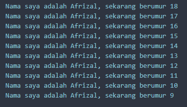
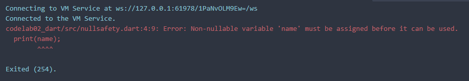
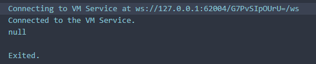
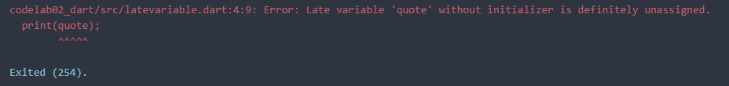
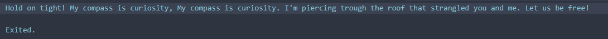

# Pemrograman Mobile - Codelab #02
Codelab #02 - Pengantar Bahasa Pemrograman Dart - Bagian 1
NIM: 2341720083
Nama: Afrizal Qurratul Faizin

## Jawaban Tugas Praktikum
1. Output yang diminta

2. Bahasa pemrograman Dart sangat diperlukan untuk dipahami dikarenakan basis dari Flutter adalah Dart dan Flutter digunakan sebagai Framework/Alat bantu dari bahasa pemrograman Dart dan dibuat diatas Dart.
3. Rangkuman dari materi Codelab ini adalah sebagai berikut:
- Bahasa Dart menggabungkan banyak kelebihan dari bahasa tingkat tinggi (high level languages) dan fitur fitur seperti: Productive Tooling, Garbage Collection, Type Annotations, Statically Typed, dan Portability
- Dart diluncurkan pada tahun 2011 dan melakukan perubahan besar pada Dart 2.0 menjelang akhir 2018 dengan fitur yang awalnya digunakan sebagai pengganti JavaScript (JS) dan menyelesaikan masalah-masalah yang ada pada JS, menawarkan performa dan alat yang lebih baik untuk projek besar, dan dibuat kuat dan flexibel.
- Dart dapat di eksekusi melalui 2 metode: Melalui Dart VM atau menggunakan dart2js untuk melakukan konversi ke JavaScript.
- Dart dapat berjalan secara Ahead of Time (AoT) atau Just In Time (JIT). Fitur _hot reload_ dari Flutter juga didasari Kompiler Dart JIT, karena Dart berkontribusi besar pada pembuatan Flutter
- Dart adalah bahasa OOP (Object Oriented Programming), yang memiliki 4 pillar utama: encapsulation, inheritance, composition, abstraction, dan polymorphism. Operator bahasa Dart hampir sama seperti bahasa OO (Object Oriented) lainnya.
- https://dartpad.dev/ dapat digunakan sebagai salah satu alat untuk bereksperimen dengan bahasa pemrograman Dart.
- Kode Dart dimulai pada fungsi `void main(){}`. File Dart memiliki ekstensi `.dart`, dengan contoh: `file.dart`
4. Perbedaan Null Safety dan Late Variable adalah Null Safety digunakan untuk mencegah adanya Null Pointer Exception dan variable bisa dibuat nullable dengan menambah `?` di tipe data, sedangkan Late Variabel adalah variabel kosong yang dibuat agar dapat diisi pada konstruktor atau nantinya. Late Variabel harus tetap diberi nilai pada akhirnya karena tetap non-nullable.

Eksekusi Kode Null Safety (Secara default):

Dengan Kode:
```
void main (){
  String name;
  print(name);
}
```
Eksekusi Kode Null Safety (menggunakan `dataType?`):

Dengan Kode:
```
void main (){
  String? name;
  print(name);
}
```

Eksekusi Kode Late Variable (Jika variabel bernilai null):

Dengan kode:
```
void main(){
  late String quote;
  // Error jika variabel quote tidak diinisialisasi/bernilai null
  print(quote);

  // Inisialisasi variabel quote
  quote = "Hold on tight! My compass is curiosity, My compass is curiosity. I'm piercing trough the roof that strangled you and me. Let us be free!";
  print(quote);
}
```
Eksekusi Kode Late Variable (Jika varibel tidak null):

Dengan Kode:
```
void main(){
  late String quote;
  // Error jika variabel quote tidak diinisialisasi/bernilai null
  //print(quote); <-- kode dikomentar agar tidak dibaca

  // Inisialisasi variabel quote
  quote = "Hold on tight! My compass is curiosity, My compass is curiosity. I'm piercing trough the roof that strangled you and me. Let us be free!";
  print(quote);
}
```