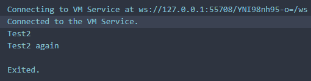
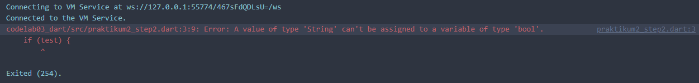
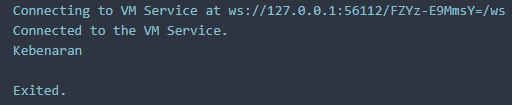
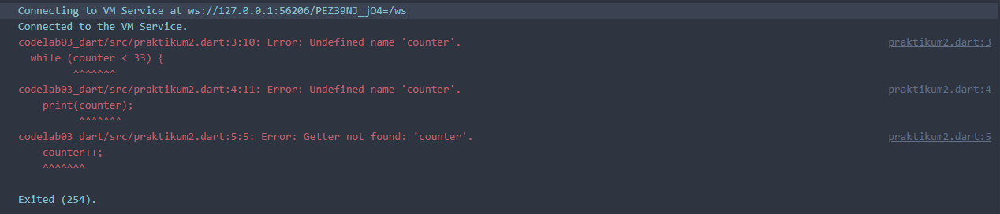
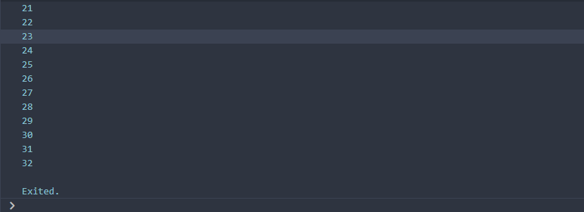
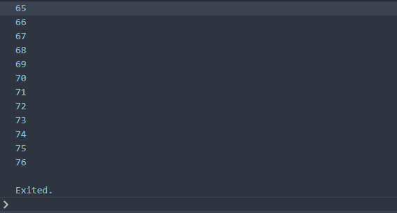
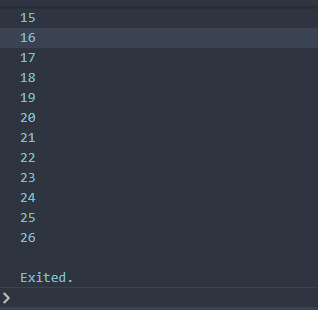
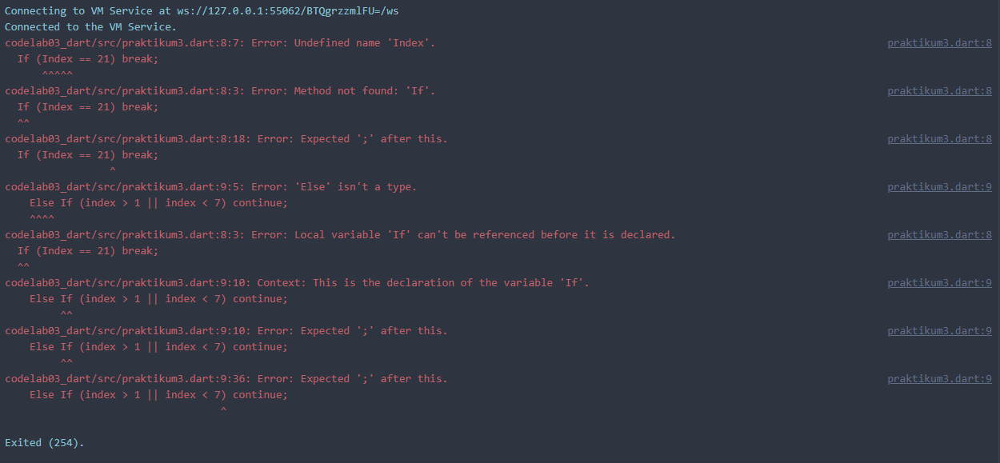
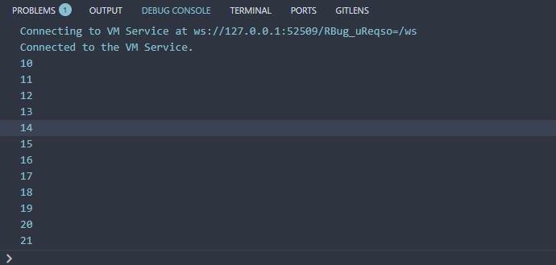
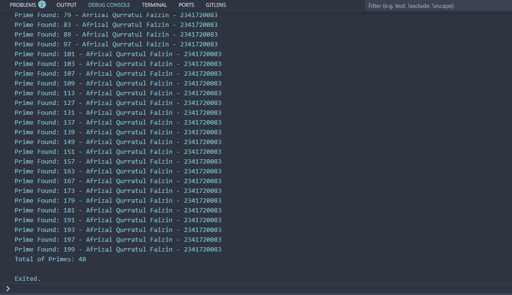

# Pemrograman Mobile - Codelab #03
Codelab #03 - Pengantar Bahasa Pemrograman Dart - Bagian 2
NIM: 2341720083
Nama: Afrizal Qurratul Faizin

## Praktikum 1
### Langkah 1
```
String test = "test2";
    if (test == "test1") {
      print("Test1");
    } else if (test == "test2") {
      print("Test2");
    } else {
      print("Something else");
    }  
if (test == "test2") print("Test2 again");
```
Output : 


### Langkah 2
Silakan coba eksekusi (Run) kode pada langkah 1 tersebut. Apa yang terjadi? Jelaskan!
**Jawaban:** Yang terjadi adalah teks "Test2" keluar dikarenakan kondisi `test == "test2"` terpenuhi setelah pengecekan. Setelah itu, ada pengecekan lagi apakah `test == "test2"` untuk melakukan output teks "Test2 again"

### Langkah 3
```
void main(){
    String test = "true"; // <--- Sumber Error
    if (test) {
      print("Kebenaran");
    }
}
```
Output: 


**Error Cause:** Value yang di cek adalah Boolean untuk menentukan statement benar atau tidak, namun variabel test adalah String. Karena kesalahan tipe data, maka akan mengalami error. Cara memperbaikinya adalah dengan mengubah tipe data variabel test.
```
void main(){
  bool test = true; //<--- Tipe data diganti
    if (test) {
      print("Kebenaran");
    } else { //<--- Penambahan else, namun dead code karena unreachable
      print("Kesalahan");
    }
}
```



## Praktikum 2: Menerapkan Perulangan "while" dan "do-while"
### Langkah 1
```
void main(){
  while (counter < 33) {
    print(counter);
    counter++;
  }
}
```
### Langkah 2


**Results and Error Cause:** Program akan mengalami error. Program tidak berjalan karena variabel `counter` belum diinisialisasi, maka program tidak tahu apa itu `counter`, cara memperbaikinya adalah dengan menambahkan inisialisasi

```
void main(){
  int counter = 0; //<--- Counter
  while (counter < 33) {
    print(counter);
    counter++;
  }
}
```



### Langkah 3
```
while (counter < 33) {
  print(counter);
  counter++;
}
```
**Results and *Possible* Error Cause:** Program akan mengalami error jika diletakkan ke **file program yang berbeda**, kecuali jika kode diatas diletakkan ke program yang sama sepert **langkah 1 dan 2**. Seperti sebelumnya, program tidak berjalan karena variabel `counter` belum diinisialisasi, maka program tidak tahu apa itu `counter`, cara memperbaikinya adalah dengan menambahkan inisialisasi.



## Praktikum 3: Menerapkan Perulangan "for" dan "break-continue"
### Langkah 1:
```
for (Index = 10; index < 27; index) {
  print(Index);
}
```
### Langkah 2:

**Results and Error Cause:** Program akan mengalami error. Program tidak berjalan karena variabel `Index` belum diinisialisasi, maka program belum itu `Index`, cara memperbaikinya adalah dengan menambahkan variabel yang bersangkutan. Pada kode, ada dua variabel berbeda, `Index`, dan `index`, maka program juga akan mengalami error, cara memperbaikinya adalah dengan membuat nama variabel sama. Pada increment pada loop belum ditambahkan, maka ubah menjadi `index++`

```
void main(){
  int index; //<--- Penambahan
  for (index = 10; index < 27; index++) {
    print(index);
  }
}
```



### Langkah 3:
```
If (Index == 21) break;
    Else If (index > 1 || index < 7) continue;
print(index);
```



**Results and Error Cause:** Program akan mengalami error. Jika program dianggap dimasukkan kedalam looping program yang sama pada **langkah 1 dan 2**, maka, error yang ada adalah karena adanya huruf kapital penggunaan `index`, `if`, dan `else if`. Jadi cara memperbaikinya adalah dengan mengubah kapitalisasi beberapa keyword menjadi kode ini:

```
void main(){
  //Step 1 and 2
  int index; //<--- Boleh seperti ini karena value ada di awal loop
  for (index = 10; index < 27; index++) {
  print(index);

  //Step 3, break jika indeks berada di angka 21, lanjutkan looping dan skip semua kode dibawahnya jika index berada di angka lebih besar dari 1 ATAU lebih kecil dari 7
  if (index == 21) break;
    else if (index > 1 || index < 7) continue;
  print(index);
  }
}
```



## Tugas Praktikum
Buatlah sebuah program yang dapat menampilkan bilangan prima dari angka 0 sampai 201 menggunakan Dart. Ketika bilangan prima ditemukan, maka tampilkan nama lengkap dan NIM Anda.

Program: https://github.com/Afqufai/codelab_dart/blob/main/codelab02_dart/src/tugas3_primeNumber.dart

