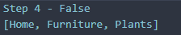
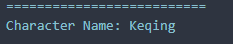

# Pemrograman Mobile - Codelab #03
Codelab #4 - Pengantar Bahasa Pemrograman Dart - Bagian 3
NIM: 2341720083
Nama: Afrizal Qurratul Faizin

## Praktikum 1
### Langkah 1
Ketik atau salin kode program ke dalam void main()
```
var list = [1, 2, 3];
assert(list.length == 3);
assert(list[1] == 2);
print(list.length);
print(list[1]);

list[1] = 1;
assert(list[1] == 1);
print(list[1]);
```

### Langkah 2
Silakan coba eksekusi (Run) kode pada langkah 1 tersebut. Apa yang terjadi? Jelaskan!

**Jawaban:**
Angka 3, 2 dan 1 akan muncul karena pada print mengambil panjang array (3), mengambil variabel di-index ke-1 pada array (2), dan dilakukan lagi setelah mengecekan `assert` dan perubahan pada index ke-1 (1).


## Langkah 3
Ubah kode pada langkah 1 menjadi variabel final yang mempunyai index = 5 dengan default value = null. Isilah nama dan NIM Anda pada elemen index ke-1 dan ke-2. Lalu print dan capture hasilnya.
Apa yang terjadi ? Jika terjadi error, silakan perbaiki.

**Jawaban:**
Yang terjadi bukan error, melainkan Exception dikarenakan pengecekan pada `assert` mengeluarkan hasil `false`. Cara memperbaikinya adalah dengan memodifikasi pengecekan assert, atau isian array agar sesuai dengan pengecekan pada `assert`. `assert` akan memberi exception dan program akan di-*halt* atau dijeda jika hasil pengecekan adalah `false`.


```
//Perbaikan:
//Step 3
  final list = [null, "Afrizal Qurratul Faizin", 2341720083, null, null];
  assert(list.length == 5);
  assert(list[1] != 2);
  print(list.length);
  print(list[1]);

  list[1] = 1;
  assert(list[1] == 1);
  print(list[1]);
```


## Praktikum 2
### Langkah 1:
Ketik atau salin kode program berikut ke dalam fungsi main().
```
var halogens = {'fluorine', 'chlorine', 'bromine', 'iodine', 'astatine'};
print(halogens);
```
### Langkah 2:
Silakan coba eksekusi (Run) kode pada langkah 1 tersebut. Apa yang terjadi? Jelaskan! Lalu perbaiki jika terjadi error.

**Jawaban:**
Kode tidak mengalami error dan akan melakukan output berupa: `{fluorine, chlorine, bromine, iodine, astatine}`, yaitu keseluruhan dari Set yang ada. Set ini dianggap Set karena keseluruhan isinya adalah tipe data String tanpa kunci.


### Langkah 3:
Tambahkan kode program berikut, lalu coba eksekusi (Run) kode Anda.
```
var names1 = <String>{};
Set<String> names2 = {}; // This works, too.
var names3 = {}; // Creates a map, not a set.

print(names1);
print(names2);
print(names3);
```
Apa yang terjadi ? Jika terjadi error, silakan perbaiki namun tetap menggunakan ketiga variabel tersebut. Tambahkan elemen nama dan NIM Anda pada kedua variabel Set tersebut dengan dua fungsi berbeda yaitu .add() dan .addAll(). Untuk variabel Map dihapus, nanti kita coba di praktikum selanjutnya.

**Jawaban:**
Program akan mengeluarkan Set yang sama, dua Set String kosong, dan satu Map kosong. Set biasanya hanya berisi satu tipe data, namun Map memiliki "key"


## Praktikum 3
### Langkah 1:
Ketik atau salin kode program berikut ke dalam fungsi main().
```
var gifts = {
  // Key:    Value
  'first': 'partridge',
  'second': 'turtledoves',
  'fifth': 1
};

var nobleGases = {
  2: 'helium',
  10: 'neon',
  18: 2,
};

print(gifts);
print(nobleGases);
```
### Langkah 2:
Silakan coba eksekusi (Run) kode pada langkah 1 tersebut. Apa yang terjadi? Jelaskan! Lalu perbaiki jika terjadi error.

**Jawaban:**
Tidak ada error yang terjadi. Program akan mengeluarkan output yang "JSON-like" dengan mengeluarkan langsung seluruh isi dari Map dan key-nya.


### Langkah 3:
Tambahkan kode program berikut, lalu coba eksekusi (Run) kode Anda.
```
var mhs1 = Map<String, String>();
gifts['first'] = 'partridge';
gifts['second'] = 'turtledoves';
gifts['fifth'] = 'golden rings';

var mhs2 = Map<int, String>();
nobleGases[2] = 'helium';
nobleGases[10] = 'neon';
nobleGases[18] = 'argon';
```
Apa yang terjadi ? Jika terjadi error, silakan perbaiki.
Tambahkan elemen nama dan NIM Anda pada tiap variabel di atas (gifts, nobleGases, mhs1, dan mhs2). Dokumentasikan hasilnya dan buat laporannya!

**Jawaban:**


Hasilnya adalah sebagai berikut dengan beberapa modifikasi. Pada beberapa Map seperti `var mhs2 = Map<int, String>();`, format diharuskan untuk memiliki tipe data yang sesuai seperti apa yang ada pada Map, misal `int, String`, maka key harus berbentuk Integer, dengan nilai/Value berupa String

## Praktikum 4
### Langkah 1:
Ketik atau salin kode program berikut ke dalam fungsi main().
```
var list = [1, 2, 3];
var list2 = [0, ...list];
print(list1);
print(list2);
print(list2.length);
```

### Langkah 2:
Silakan coba eksekusi (Run) kode pada langkah 1 tersebut. Apa yang terjadi? Jelaskan! Lalu perbaiki jika terjadi error.

**Jawaban:**
Ada error yang terjadi karena kesalahan tulis dalam list. Program mencoba memanggil `list1`, sementara yang di buat adalah `list`. Cara memperbaikinya adalah dengan mengubah `list1` menjadi `list` atau sebaliknya.


Menggunakan extension `Error Lens`, Error dapat langsung terdeteksi beserta pesannya.


Hasil setelah perbaikan:


### Langkah 3:

Tambahkan kode program berikut, lalu coba eksekusi(Run) kode Anda
```
list1 = [1, 2, null];
print(list1);
var list3 = [0, ...?list1];
print(list3.length);
```
Apa yang terjadi ? Jika terjadi error, silakan perbaiki.
Tambahkan variabel list berisi NIM Anda menggunakan Spread Operators. Dokumentasikan hasilnya dan buat laporannya!

**Jawaban:**


Pada langkah ini, terjadi error karena belum ada `var` sebelum deklarasi `list1`, cara memperbaikinya adalah dengan memberi `var` pada list sebelum nama list.


### Langkah 4
Tambahkan kode program berikut, lalu coba eksekusi (Run) kode Anda.
```
var nav = ['Home', 'Furniture', 'Plants', if (promoActive) 'Outlet'];
print(nav);
```
Apa yang terjadi ? Jika terjadi error, silakan perbaiki. Tunjukkan hasilnya jika variabel `promoActive` ketika `true` dan `false`

**Jawaban:**

Ada error dikarenakan `promoActive` belum diinisialisasi. Pada hasil `true`, maka Outlet akan muncul pada list, namun pada kondisi `false`, maka Outlet tidak akan masuk kedalam list, dan beberapa bagian list akan dianggap dead code jika kondisi berada di akhir.

Error (Error Lens):


`promoActive` bernilai `true`:


`promoActive` bernilai `false`:




### Langkah 5
Tambahkan kode program berikut, lalu coba eksekusi (Run) kode Anda.

```
var nav2 = ['Home', 'Furniture', 'Plants', if (login case 'Manager') 'Inventory'];
print(nav2);
```

Apa yang terjadi ? Jika terjadi error, silakan perbaiki. Tunjukkan hasilnya jika variabel login mempunyai kondisi lain. 

**Jawaban:**

Sama seperti sebelumnya, ada error yang terjadi karena variabel `login` tidak ada. Untuk memperbaikinya adalah dengan membuat variabel `login` dengan nilai `'Manager'`.


Kondisi `login case 'Manager'` True: 


Kondisi `login case 'Manager'` False / Variabel Login bukan 'Manager':


### Langkah 6

Tambahkan kode program berikut, lalu coba eksekusi (Run) kode Anda.
```
var listOfInts = [1, 2, 3];
var listOfStrings = ['#0', for (var i in listOfInts) '#$i'];
assert(listOfStrings[1] == '#1');
print(listOfStrings);
```
Apa yang terjadi ? Jika terjadi error, silakan perbaiki. Jelaskan manfaat Collection For dan dokumentasikan hasilnya.

**Jawaban:**


Output tersebut, pada list akan mengeluarkan angka dengan hastag dari 0 sampai 3. Manfaat dari Collection For adalah untuk memasukkan isian list ke list yang lain dengan efisien daripada harus masuk lewat assert satu-per-satu

## Praktikum 5
### Langkah 1
Ketik atau salin kode program berikut ke dalam fungsi main().

```
var record = ('first', a: 2, b: true, 'last');
print(record)
```

### Langkah 2
Silakan coba eksekusi (Run) kode pada langkah 1 tersebut. Apa yang terjadi? Jelaskan! Lalu perbaiki jika terjadi error.

**Jawaban:**

Ada error pada kode tersebut karena hilangnya semi-colon (`;`) pada line ke-dua.


Pada kode tersebut akan dikeluarkan list yang berurutan dari elemen posisional (`'first' & 'last'`, urut secara alfabet) lalu ke elemen bernama.


### Langkah 3

```
(int, int) tukar((int, int) record) {
  var (a, b) = record;
  return (b, a);
}
```

Apa yang terjadi ? Jika terjadi error, silakan perbaiki. Gunakan fungsi tukar() di dalam main() sehingga tampak jelas proses pertukaran value field di dalam Records.

**Jawaban:**

Karena hampir tidak memungkinkan untuk menggunakan record pertama karena isi record yang berisi multi data type, sedangkan fungsi tukar hanya dapat menerima dan mengeluarkan integer, maka record baru dibuat dengan kode seperti berikut:

```
  //Step 3
  var anotherRecord = (1, 2);
  print(anotherRecord);
  var swappedRecord = tukar(anotherRecord);
  print(swappedRecord);
```

Dengan hasil:


### Langkah 4

Tambahkan kode program berikut di dalam scope void main(), lalu coba eksekusi (Run) kode Anda.

```
// Record type annotation in a variable declaration:
(String, int) mahasiswa;
print(mahasiswa);
```

Apa yang terjadi ? Jika terjadi error, silakan perbaiki. Inisialisasi field nama dan NIM Anda pada variabel record mahasiswa di atas. Dokumentasikan hasilnya dan buat laporannya!

**Jawaban:**

Program hanya akan mengalami error jika field `mahasiswa` belum diinisialisasi atau nama/NIM terbalik.

Nama/NIM Terbalik:


`mahasiswa` kosong:


Output Benar:


### Langkah 5
Tambahkan kode program berikut di dalam scope void main(), lalu coba eksekusi (Run) kode Anda.

```
var mahasiswa2 = ('first', a: 2, b: true, 'last');

print(mahasiswa2.$1); // Prints 'first'
print(mahasiswa2.a); // Prints 2
print(mahasiswa2.b); // Prints true
print(mahasiswa2.$2); // Prints 'last'
```

Apa yang terjadi ? Jika terjadi error, silakan perbaiki. Gantilah salah satu isi record dengan nama dan NIM Anda, lalu dokumentasikan hasilnya dan buat laporannya!

**Jawaban:**


```
  // Step 5
  var mahasiswa2 = ('Afrizal Qurratul Faizin', a: 2, b: 2341720083, 'last');
  print(mahasiswa2.$1); // Prints 'first'
  print(mahasiswa2.a); // Prints 2
  print(mahasiswa2.b); // Prints true
  print(mahasiswa2.$2); // Prints 'last'
```

Yang terjadi adalah nilai elemen positional dimunculkan/dipanggil menggunakan tanda `$`, sedangkan untuk memanggil elemen bernama harus dipanggil dengan namanya seperti `a` atau `b` untuk mengeluarkan isi elemen tersebut.

## Tugas Praktikum
1. Silakan selesaikan Praktikum 1 sampai 5, lalu dokumentasikan berupa screenshot hasil pekerjaan Anda beserta penjelasannya!
2. Jelaskan yang dimaksud Functions dalam bahasa Dart!
3. Jelaskan jenis-jenis parameter di Functions beserta contoh sintaksnya!
4. Jelaskan maksud Functions sebagai first-class objects beserta contoh sintaknya!
5. Apa itu Anonymous Functions? Jelaskan dan berikan contohnya!
6. Jelaskan perbedaan Lexical scope dan Lexical closures! Berikan contohnya!
7. Jelaskan dengan contoh cara membuat return multiple value di Functions!

**Jawaban**

1. Tertera di atas.
2. Functions atau fungsi adalah block kode/bagian kode terorganisir yang ada diluar `main` yang berperan untuk digunakan berulang-ulang dan digunakan untuk "merapikan" kode. Fungsi dapat memiliki hasil return atau parameter yang dimasukkan kedalam fungsi.
3. Pada dart, ada 4 jenis parameter yang dapat digunakan, beberapa diantaranya adalah:

  Positional Parameters, digunakan berdasarkan posisi dari parameter, contohnya adalah:
  ```
    void main(List<String> args) {
      // Nomer 3-1 - Positional Parameter
      sayhello('Grimm', 'Hello'); // Mengeluarkan "Hello, Grimm!"
    }

    // Fungsi dengan positional parameter
    void sayhello(String name, String message) {
      print('$message, $name!');
    }
  ```
  Dengan hasil keluaran:
  
  
   
  Optional parameters, berisi parameter yang tidak wajib di-isi, didefinisikan menggunakan kurung siku `[]`, dan bisa diberi nilai default jika dikosongkan.
   ```
  void sayhello2(String name, [String? message]) {
    if (message != null) {
      print('$message, $name!');
    } else {
      print('G\'day, $name!');
    }
  }
   ```
   Dengan hasil keluaran dengan satu parameter:

  

  Named Parameters, didefinisikan menggunakan kurung kurawal `{}`, parameter ini harus disebutkan namanya dengan urutan bebas, membuat kode lebih mudah dibaca.
  ```
    void weaponStats({String? name, int? materialID}){
      print('Weapon Name: $name');
      print('Material ID: $materialID');
    }

    // Inside Main
    weaponStats(name: '\"The Chariot\"', materialID: 1001);
    weaponStats(materialID: 1002, name: 'Durandal');
  ```
  Dengan hasil keluaran:
  
  

  dan Required Parameter, Parameter yang harus dimasukkan kedalam fungsi, atau error akan terjadi.
    
  ```
    void printCharName({required String name}){
      print('Character Name: $name');
    }
  ```
  Dengan hasil error jika parameter dikosongkan:
  
  

  Hasil Sebenarnya:

  

4. Function sebagai first-class objects adalah pernyataan bahwa function juga dapat diperlakukan seperti variabel lainnya, seperti `int`, `String`, dan sebagainya. Beberapa contoh sintaksnya adalah:

Simpan Fungsi sebagai Variabel:
```
// Simpan fungsi ke variabel
void printCharName({required String name}){
  print('Character Name: $name');
}

void main(){
  var namaKarakter = printCharName;
  namaKarakter(name: 'Ayaka Yukina');
}

// Output:
// Character Name: Ayaka Yukina
```

Teruskan Fungsi sebagai argumen:
```
void executeFunction(Function myFunction, int randomNumber, String anotherRandomString) {
  print('Random Number: $randomNumber');
  print('Another Random String: $anotherRandomString');
  myFunction();
}
//Fungsi lain
void windetteQuote() {
  print('I HAVE\'T SEEN THE SUN IN THREE DAYS! - Windette');
}

void main(){
  executeFunction(windetteQuote, 42, 'OH! BANANA!');
}
// Output:
// Random Number: 42
// Another Random String: OH! BANANA!
// I HAVE'T SEEN THE SUN IN THREE DAYS! - Windette
```

dan Mengembalikan fungsi dari fungsi lain:
```
void main(){
  var multiplyBy3 = multiply(3);
  print(multiplyBy3(10));
}
Function multiply(int faktor) {
  return (int number) => number * faktor;
}
// Output: 30
```

5. Anonymous function adalah fungsi tanpa nama yang disebut Lambda atau Closures. Fungsi dapat disimpan ke variabel atau argumen fungsi lain. Biasanya sekali pakai.

Contoh:
```
  // Anonymous Function (pakai foreach)
  var roseliaMembers = ['Yukina', 'Sayo', 'Lisa', 'Ako', 'Rinko'];
  // For Each Anon Function
  roseliaMembers.forEach((member) {
    print(member);
  });

  // Map Anon Function, mengubah tiap elemen list
  var lengths = roseliaMembers.map((member) => member.length);
  print(lengths);
```

Dengan output:


6. Perbedaan utama dari Lexical scope adalah Lexical scope aturan dimana variabel dapat diakses dan dilihat di dalam kode program, berdasarkan di mana variabel tersebut dideklarasikan secara fisik atau "statis" di dalam kode. Sebuah blok hanya bisa mengakses variabel yang dideklarasikan di dalam blok itu atau di blok yang lebih luas seperti pada global.

Contohnya adalah:
```
var namaGlobal = 'Dart'; // Variabel di lingkup global
void fungsiLuar() {
  var namaLuar = 'Flutter'; // Variabel di lingkup fungsiLuar
  void fungsiDalam() {
    var namaDalam = 'Google'; // Variabel di lingkup fungsiDalam
    // Semua variabel bisa diakses di sini
    print(namaGlobal);
    print(namaLuar);
    print(namaDalam);
  }
  
  // Hanya variabel di lingkup yang sama atau diluar bisa dipakai
  print(namaGlobal);
  print(namaLuar);
  // print(namaDalam);  // ERROR, variabel ada di dalam, di luar tidak terbaca.
}
```

Dan sementara itu, Lexical closures adalah fungsi yang memiliki akses ke variabel-variabel yang ada di lingkup luarnya, bahkan setelah lingkup luar tersebut selesai dieksekusi dengan contoh:
```
Function counters() {
  var count = 0; 
  return () {
    count++;
    print(count);
  };
}

void main() {
  var counter1 = counters(); 
  // Panggil 'counter1'. 'count' akan diingat.
  counter1(); // 1
  counter1(); // 2
  counter1(); // 3
}
```

7. Cara membuat multiple value di functions adalah dengan menambah tanda kurung `()` pada function seperti `(int, String) functionName`. Multivalue return akan mengeluarkan hasil dengan hasil berupa record/list.

```
// Multiple value
(String, String, String, int) makeCharInfo(String name, String riskLevel, String origin, int qlipothCount) {
  return (name, riskLevel, origin, qlipothCount); //Mengeluarkan 4 variabel atau list/map
}

void main(List<String> args) {
  List<String> roseliaMember = ['Yukina Minato', 'Lisa Imai', 'Rinko Shirokane', 'Sayo Hikawa', 'Ako Udagawa'];
  List<String> riskLevel = ['Zayin', 'Teth', 'He', 'Vav', 'Aleph'];
  List<String> origin = ['Bandori', 'Earth', 'Multiversal'];

  // Destructuring / Mapping
  // Yukina Minato dengan risk level "Aleph"
  var (name, level, org, qlipoth) = makeCharInfo(roseliaMember[0], riskLevel[4], origin[0], 3);
  var mapInfo = makeCharInfo(roseliaMember[0], riskLevel[4], origin[0], 3);
  //Print MAP
  print(mapInfo);
  // Individual, satu satu setelah destructure
  print("=======================");
  print('Character Name: $name');
  print('Risk Level: $level');
  print('Origin: $org');
  print('Qlipoth Count: $qlipoth');
}
```

Dengan output sebagai berikut:

