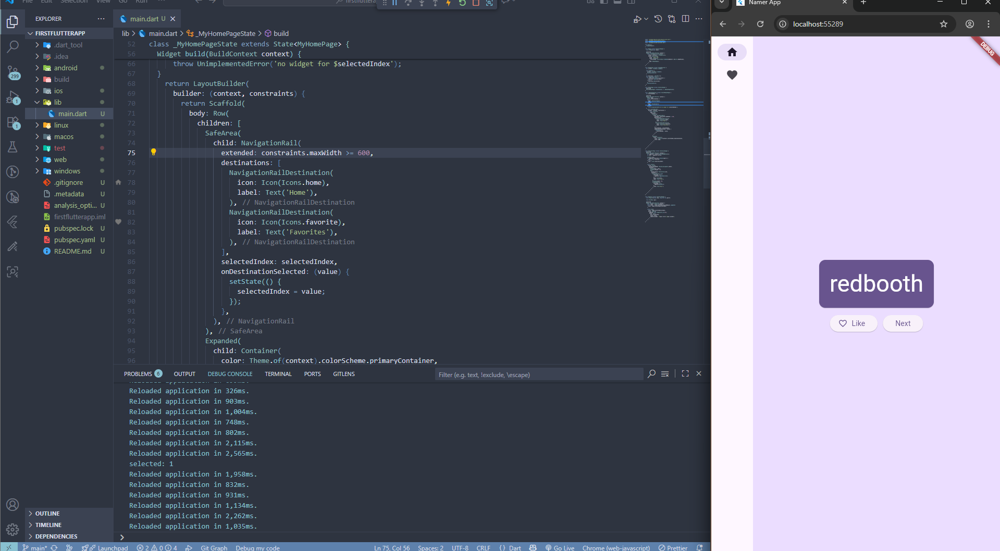

# Pemrograman Mobile - Codelab #05
Codelab #5 - Aplikasi Pertama dan Widget Dasar Flutter
NIM: 2341720083
Nama: Afrizal Qurratul Faizin

## Praktikum 1
### Langkah 1
Buka VS Code, lalu tekan tombol Ctrl + Shift + P maka akan tampil Command Palette, lalu ketik Flutter. Pilih New Application Project.


### Langkah 2
Kemudian buat folder sesuai style laporan praktikum yang Anda pilih. Disarankan pada folder dokumen atau desktop atau alamat folder lain yang tidak terlalu dalam atau panjang. Lalu pilih Select a folder to create the project in.


### Langkah 3
Buat nama project flutter hello_world seperti berikut, lalu tekan Enter. Tunggu hingga proses pembuatan project baru selesai.


> Catatan: Project sudah dibuat sebelumnya, sebelum *screenshot* ini diambil.

### Langkah 4
Jika sudah selesai proses pembuatan project baru, pastikan tampilan seperti berikut. Pesan akan tampil berupa "Your Flutter Project is ready!" artinya Anda telah berhasil membuat project Flutter baru.


## Praktikum 2
### Langkah 1 - Mengaktifkan proses debug USB

Di perangkat Android, ketuk `Settings > About phone` lalu ketuk `Build number` tujuh kali. Jika diminta, masukkan sandi atau PIN perangkat. Anda tahu Anda telah berhasil saat melihat pesan `You are now a developer!`.


### Langkah 2

Kembali ke Settings, lalu ketuk `System > Developer options`. Jika Anda tidak melihat `Developer options`, ketuk Advanced options. Ketuk `Opsi developer`, lalu ketuk tombol `Proses debug USB` untuk mengaktifkannya.


### Langkah 3 - Menginstal Driver USB Google (khusus Windows)

Di Android Studio, klik `Tools > SDK Manager`. Dialog `Preferences > Appearance & Behavior > System Settings > Android SDK` akan terbuka. Klik tab `SDK Tools` lalu pilih `Google USB Driver`, lalu klik `OK`


### Langkah 4

Sambungkan perangkat Android ke komputer menggunakan kabel USB. Dialog yang meminta Anda mengizinkan proses debug USB akan muncul di perangkat dan pilih kotak centang `Always allow from this computer`, lalu ketuk `OK`.

Di Android Studio di komputer, pastikan perangkat Anda dipilih di menu dropdown. Klik tombol `run`.


Pilih perangkat lalu klik `OK`. Android Studio akan menginstal aplikasi di perangkat, lalu menjalankannya. Jika perangkat menjalankan platform Android yang tidak diinstal di Android Studio dan melihat pesan berisi pertanyaan apakah Anda ingin menginstal platform yang diperlukan, klik `Install > Continue > Finish`. Android Studio akan menginstal aplikasi di perangkat, lalu menjalankannya.

> Dikarenakan perangkat berhasil terhubung melalui Kabel USB, maka metode wireless tidak diperlukan.

## Praktikum 3

> Catatan: Untuk menyesuaikan dengan laporan sesuai dengan **style** yang sudah saya tentukan, maka langkah 1 sampai 10 akan dilewati, file project hello_world juga ada didalam repositori ini.

### Langkah 11

Ubah platform di pojok kanan bawah ke emulator atau device atau bisa juga menggunakan browser Chrome. Lalu coba running project hello_world dengan tekan F5 atau Run > Start Debugging. Tunggu proses kompilasi hingga selesai, maka aplikasi flutter pertama Anda akan tampil seperti berikut.


### Langkah 12

Silakan screenshot seperti pada Langkah 11, namun teks yang ditampilkan dalam aplikasi berupa nama lengkap Anda. Simpan file screenshot dengan nama 01.png pada folder images (buat folder baru jika belum ada) di project hello_world Anda. Lalu ubah isi README.md seperti berikut, sehingga tampil hasil screenshot pada file README.md. Kemudian push ke repository Anda.


## Praktikum 4

### Langkah 1
Buat folder baru basic_widgets di dalam folder lib. Kemudian buat file baru di dalam basic_widgets dengan nama text_widget.dart. Ketik atau salin kode program berikut ke project hello_world Anda pada file text_widget.dart.

Lakukan import file text_widget.dart ke main.dart, lalu ganti bagian text widget dengan kode di atas. Maka hasilnya seperti gambar berikut. Screenshot hasil milik Anda, lalu dibuat laporan pada file README.md.


### Langkah 2
Buat sebuah file image_widget.dart di dalam folder basic_widgets dengan isi kode berikut.

```
flutter:
  assets:
     - logo_polinema.jpg
```

Lakukan penyesuaian asset pada file pubspec.yaml dan tambahkan file logo Anda di folder assets project hello_world.


## Praktikum 5

Selesaikan langkah-langkah praktikum berikut ini dengan melanjutkan project hello_world Anda. Lakukan langkah yang sama seperti pada Praktikum 3, yaitu setiap widget dibuat file sendiri lalu import ke main.dart dan screenshot hasilnya.

### Langkah 1
Buat file di `basic_widgets > loading_cupertino.dart`. Import stateless widget dari material dan cupertino. Lalu isi kode di dalam method Widget build adalah sebagai berikut.
```
import 'package:flutter/material.dart';
import 'package:flutter/cupertino.dart';

class LoadingCupertino extends StatelessWidget {
  const LoadingCupertino({Key? key}) : super(key: key);

  @override
  Widget build(BuildContext context) {
    return Column(
      children: const <Widget>[
        CupertinoButton(
          child: Text("Contoh button"),
          onPressed: null,
        ),
        CupertinoActivityIndicator(),
      ],
    );
  }
}
```

### Langkah 2
Langkah 2: Floating Action Button (FAB)
Button widget terdapat beberapa macam pada flutter yaitu ButtonBar, DropdownButton, TextButton, FloatingActionButton, IconButton, OutlineButton, PopupMenuButton, dan ElevatedButton. Buat file di basic_widgets > fab_widget.dart. Import stateless widget dari material. Lalu isi kode di dalam method Widget build adalah sebagai berikut.

```
import 'package:flutter/material.dart';

class FabWidget extends StatelessWidget {
  const FabWidget({Key? key}) : super(key: key);

  @override
  Widget build(BuildContext context) {
    return FloatingActionButton(
      onPressed: () {
        // Tambahkan kode
      },
      backgroundColor: Colors.pink,
      child: const Icon(Icons.thumb_up),
    );
  }
}
```

### Langkah 3
Scaffold widget digunakan untuk mengatur tata letak sesuai dengan material design.

> Catatan, Widget pada langkah 1, 2, dan 3 di atas dimasukkan bersamaan pada langkah ini. Perubahan pada kode tertera di atas karena adanya error yang menyebabkan blackscreen pada device yang terhubung.


### Langkah 4

> Catatan, beberapa kode dikonfigurasi ulang.


### Langkah 5

> Catatan, beberapa kode dikonfigurasi ulang.


### Langkah 6

> Catatan, beberapa kode dikonfigurasi ulang.


## Tugas Praktikum:

1. Selesaikan Praktikum 1 sampai 5, lalu dokumentasikan dan push ke repository Anda berupa screenshot setiap hasil pekerjaan beserta penjelasannya di file README.md! (https://jti-polinema.github.io/flutter-codelab/05-first-app-widget-dasar-flutter/)
2. Selesaikan Praktikum 2 dan Anda wajib menjalankan aplikasi  pada perangkat fisik (device Android/iOS) agar Anda mempunyai pengalaman untuk menghubungkan ke perangkat fisik. Foto hasil aplikasi di perangkat, lalu buatlah laporan praktikum pada file README.md.
3. Pada praktikum 5 mulai dari Langkah 3 sampai 6, buatlah file widget tersendiri di folder basic_widgets, kemudian pada file main.dart cukup melakukan import widget sesuai masing-masing langkah tersebut!
4. Selesaikan Codelabs: Your first Flutter app, lalu buatlah laporan praktikumnya dan push ke repository GitHub Anda!
5. README.md berisi: capture hasil akhir tiap praktikum (, bisa juga berupa file GIF agar terlihat proses perubahan ketika ada aksi dari pengguna) dengan menampilkan NIM dan Nama Anda sebagai ciri pekerjaan Anda.

## Jawaban Tugas Praktikum
1. Semua telah tertera di-atas.
   
   > Hasil keluaran pada project Hello World pada Codelab Jobsheet tertera pada folder `app/hello_world`

2. Tertera di-atas.
3. Widget telah diletakkan secara sendiri-sendiri
   


##  Hasil Screenshot Tugas 4 dengan membuat proyek baru
> Kode Tugas Nomor 4 pada Codelab milik Google tertera pada folder `app/firstflutterapp`

### Create a Project


### Add a Button & Hot Reload Pertama


### Menambah Fungsi Baru
Meski perubahan pada tahapa ini tidak begitu jelas, tapi ada perbedaan jika tombol "Next" ditekan


### Memperindah Aplikasi


### Menambahkan Fungsi


### Tambah Kolom Navigasi




### Menambah Halaman Baru


5. Pada hasil screenshot kebanyakan telah diberi keterangan nama dan NIM.
6. Link dikumpulkan via Google Classroom.