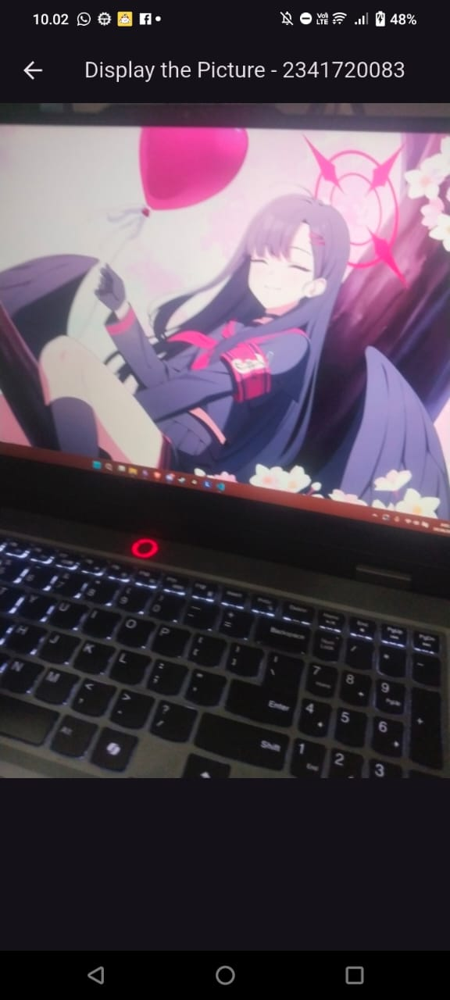
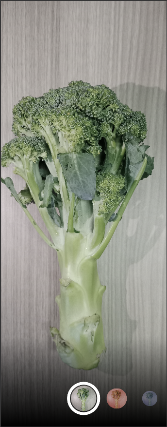
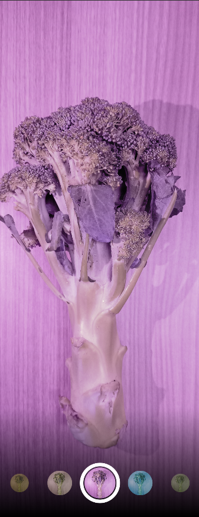
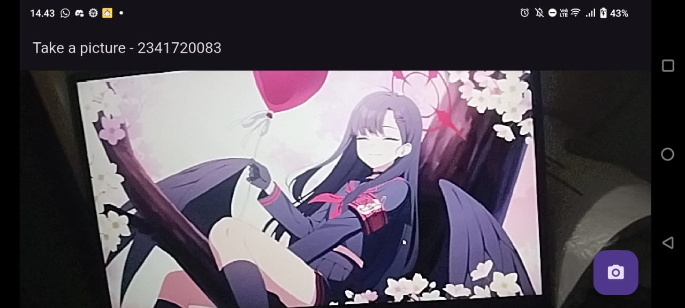
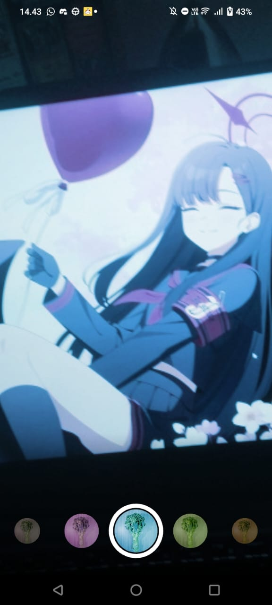

# Pemrograman Mobile - Codelab #07
Codelab #9 - Kamera
NIM: 2341720083
Nama: Afrizal Qurratul Faizin

## Hasil Praktikum 1

### Penjelasan: 
- `TakePictureScreen()` digunakan sebagai template atau cetakan untuk layar utama, dibuat sebagai StatefulWidget. Tugas utamanya untuk menerima variabel camera yang dibuat dari main sebelum dieksekusi dan membuat object TakePictureScreenState untuk logikanya.
- `TakePictureScreenState` adalah semua logika dan data state disimpan. Dia mengkontrol _controller dan _initializeControllerFuture (yang dipakai untuk melacak status inisialisasi kamera). 
- `initState()` digunakan untuk "menghidupkan" CameraController-nya. _controller dibuat dengan memberinya data kamera dan resolusi ResolutionPreset.medium. Setelah itu, panggil _controller.initialize() dan simpan Future dari proses itu ke dalam variabel _initializeControllerFuture untuk digunakan di build.
- `dispose()` digunakan untuk menghancurkan widget (misalnya saat menekan tombol back ditekan atau pindah ke layar lain). _controller.dispose() digunakan untuk "mematikan" koneksi ke kamera secara resmi. Penting untuk melepas resource agar tidak terjadi memory leak atau crash.
- `build() dengan FutureBuilder` yang bertugas untuk mengecek _initializeControllerFuture dari initState. Selama Future masih bekerja, builder akan menampilkan CircularProgressIndicator (loading). Begitu Future selesai, builder akan otomatis mengganti loading itu dengan widget CameraPreview(_controller), yang menampilkan feed live dari kamera.
- `FloatingActionButton()` digunakan untuk await _controller.takePicture() yang digunakan untuk menjepret foto dan mengembalikan object image berisi lokasi file dan Navigator.of(context).push dipakai untuk navigasi ke layar `DisplayPictureScreen()` sambil passing data image.path ke layar baru tersebut.
- `DisplayPictureScreen()` digunakan untuk display foto yang diambil dari Image.file(File(imagePath)) internal perangkat

## Hasil Praktikum 2

Catatan: Tidak berfungsi dengan benar di Handphone sebelum dilakukan `flutter clean`.

### Penjelasan:
- `PhotoFilterCarousel()` digunakan sebagai halaman utama yang menggabungkan semua elemen. Digunakan untuk menyimpan daftar filter padal ist _filters dan filter yang sedang aktif pada _filterColor, Menggunakan Stack untuk menumpuk gambar utama (_buildPhotoWithFilter) di belakang dan carousel pemilih filter (_buildFilterSelector) di depan (bagian bawah). Ini juga menggunakan ValueListenableBuilder agar hanya gambar utama yang di-refresh (diberi blend mode warna baru) ketika _filterColor berubah, sehingga sangat efisien.
- `FilterSelector` berisi carousel filter yang bisa di-scroll di bagian bawah. Dibuat sebagai StatefulWidget untuk mengelola PageController yang berfungsi untuk mengontrol scrolling dan mengetahui halaman/filter mana (_page) yang sedang aktif. Widget ini menggunakan Stack untuk menumpuk tiga hal: gradien bayangan hitam (_buildShadowGradient), carousel filter (_buildCarousel), dan lingkaran putih statis di tengah sebagai penanda pilihan (_buildSelectionRing).
- `CarouselFlowDelegate` digunakan untuk menghitung posisi, ukuran item (itemScale), dan opacity untuk setiap item filter berdasarkan seberapa jauh item itu dari pusat layar.
- `FilterItem` digunakan untuk menampilkan gambar teksturdi dalam ClipOval lalu menerima color dan menerapkannya ke gambar sebagai filter melalui BlendMode.hardLight. GestureDetector juga membungkus semuanya agar widget ini bisa di-tap untuk memanggil fungsi onFilterSelected untuk menganimasikan scroll ke item tersebut.

## Tugas Praktikum
1. Selesaikan Praktikum 1 dan 2, lalu dokumentasikan dan push ke repository Anda berupa screenshot setiap hasil pekerjaan beserta penjelasannya di file README.md! Jika terdapat error atau kode yang tidak dapat berjalan, silakan Anda perbaiki sesuai tujuan aplikasi dibuat!
2. Gabungkan hasil praktikum 1 dengan hasil praktikum 2 sehingga setelah melakukan pengambilan foto, dapat dibuat filter carouselnya!
3. Jelaskan maksud void async pada praktikum 1?
4. Jelaskan fungsi dari anotasi @immutable dan @override ?
5. Kumpulkan link commit repository GitHub Anda kepada dosen yang telah disepakati!

### Jawaban

1. Tertera diatas.
2. Hasil gabungan kedua praktikum adalah seperti ini:

3. `void` pada main itu sendiri adalah fungsi main tidak mengeluarkan hasil return, sedangkan `async` atau (asynchronous) adalah fungsi yang membutuhkan waktu untuk dijalankan, biasanya digunakan bersama `await` atau fungsi untuk menunggu. Pada praktikum ini, `async` digunakan karena untuk membuat kamera, dibutuhkan waktu `await` untuk mencari kamera yang ada.
4. `@immutable` adalah tanda yang digunakan pada kelas yang berarti bahwa nilai didalamnya tidak akan bisa dirubah jika objek dibuat. Sedangkan `@override` adalah tanda pada kelas bahwa fungsi tersebut memiliki nama yang sama dengan kelas induk dan digunakan untuk menimpa fungsi di induk untuk menjalankan fungsi tersebut.
5. https://github.com/Afqufai/codelab_dart/blob/main/codelab09_dart/README.md