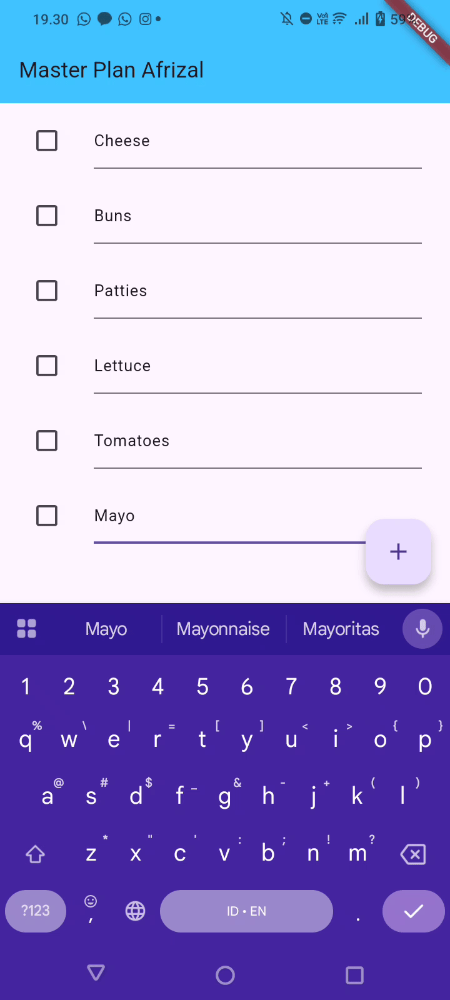
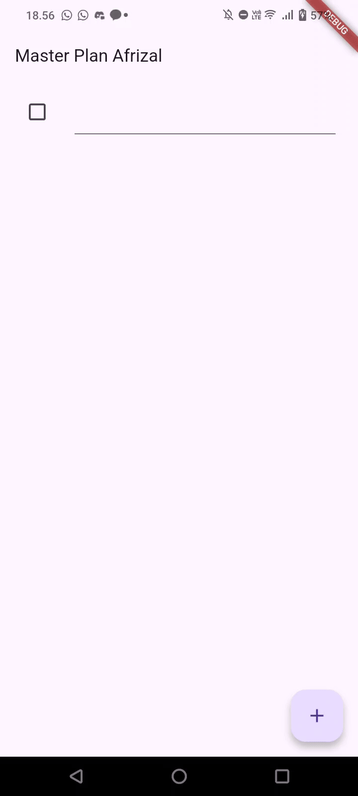
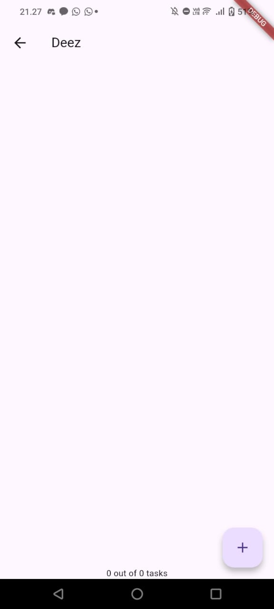
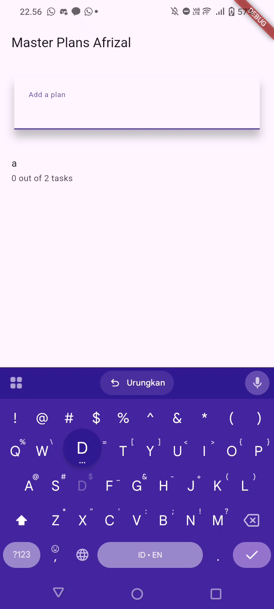

# Pemrograman Mobile - Codelab #10
Codelab #10 - Dasar State Management

NIM: 2341720083

Nama: Afrizal Qurratul Faizin

## Percobaan Praktikum 1

Penjelasan: 
- Class Task pada langkah 2 berisi string deskripsi yang digunakan untuk diisi oleh pengguna, dan boolean complete yang digunakan sebagai checklist. Konstruktor `const` dibuat dengan nilai complete default false dan deskripsi kosong
- Class plan digunakan untuk menyimpan List dari objek Task dengan String name sebagai nama unik dari plan dan list dari Task untuk menyimpan daftar rencana
- Untuk mempermudah proses import, pada file `data_layer.dart` hanya diisi export dari kedua kelas tersebut, sehingga pada melakukan import pada file tersebut akan memberi akses pada file `plan.dart` dan `task.dart`.
- Pada file `main.dart`, ganti semua kode agar `home: PlanScreen()` ditampilkan. Karena mengalami error, pada langkah selanjutnya screen dibuat pada `plan_screen.dart` dengan membuat Scaffold dan kelas screen dibuat menggunakan StatefulWidget karena menggunakan State untuk pembuatannya. Pada file tersebut, variabel plan dengan objek Plan untuk membuat list pada `_buildAddTaskButton()` jika di klik yang sudah ditambahkan pada _PlanScreenState() dibawah _buildList().
-  Pada langkah 9 `_buildTaskTile` digunakan untuk membuat tiling untuk membuat list dari task dengan `ListTile` yang digunakan untuk membuat list seperti to-do-list dengan title berupa `TextFormField` yang akan diisi oleh nama task yang akan diketik oleh pengguna.
-  `ScrollController` ditambahkan pada `plan_screen.dart` untuk menghapus focus dari semua TextField selama event scroll dilakukan. Selanjutnya, scan dengan `keyboardDismissBehavior` apakah platform yang digunakan adalah iOS atau bukan, sehingga yang terjadi adalah mengetik list dipermudah jika sudah dibawah, dan `dispose` dilakukan untuk membuang widget jika tidak dipakai untuk menghemat memori.

## Tugas Praktikum 1
1. Selesaikan langkah-langkah praktikum tersebut, lalu dokumentasikan berupa GIF hasil akhir praktikum beserta penjelasannya di file README.md! Jika Anda menemukan ada yang error atau tidak berjalan dengan baik, silakan diperbaiki.
2. Jelaskan maksud dari langkah 4 pada praktikum tersebut! Mengapa dilakukan demikian?
3. Mengapa perlu variabel plan di langkah 6 pada praktikum tersebut? Mengapa dibuat konstanta ?
4. Lakukan capture hasil dari Langkah 9 berupa GIF, kemudian jelaskan apa yang telah Anda buat!
5. Apa kegunaan method pada Langkah 11 dan 13 dalam lifecyle state ?
6. Kumpulkan laporan praktikum Anda berupa link commit atau repository GitHub ke dosen yang telah disepakati !

## Jawaban
1. Tertera pada bagian Percobaan Praktikum 1.
2. Maksud dari langkah ke-4 adalah untuk mempermudah proses import, sehingga saat melakukan proses import pada file lain, file yang dirujuk, pada kasus ini adalah `data_layer.dart` yang akan memberikan akses import pada file `plan.dart` dan `task.dart` tanpa harus memanggilnya satu per satu jika file `data_layer.dart` di import. Ini digunakan untuk menghemat line.
3. Variabel plan dibuat konstanta digunakan karena nilai tidak dapat diubah selama aplikasi digunakan. Digunakan juga untuk optimisasi aplikasi dan menjaga kebersihan kode.
4. Hasil pada GIF adalah sebagai berikut

Yang telah saya buat adalah sebagai berikut:
- Class Task pada langkah 2 berisi string deskripsi yang digunakan untuk diisi oleh pengguna, dan boolean complete yang digunakan sebagai checklist. Konstruktor `const` dibuat dengan nilai complete default false dan deskripsi kosong
- Class plan digunakan untuk menyimpan List dari objek Task dengan String name sebagai nama unik dari plan dan list dari Task untuk menyimpan daftar rencana
- Untuk mempermudah proses import, pada file `data_layer.dart` hanya diisi export dari kedua kelas tersebut, sehingga pada melakukan import pada file tersebut akan memberi akses pada file `plan.dart` dan `task.dart`.
- Pada file `main.dart`, ganti semua kode agar `home: PlanScreen()` ditampilkan. Karena mengalami error, pada langkah selanjutnya screen dibuat pada `plan_screen.dart` dengan membuat Scaffold dan kelas screen dibuat menggunakan StatefulWidget karena menggunakan State untuk pembuatannya. Pada file tersebut, variabel plan dengan objek Plan untuk membuat list pada `_buildAddTaskButton()` jika di klik yang sudah ditambahkan pada _PlanScreenState() dibawah _buildList().
-  Pada langkah 9 `_buildTaskTile` digunakan untuk membuat tiling untuk membuat list dari task dengan `ListTile` yang digunakan untuk membuat list seperti to-do-list dengan title berupa `TextFormField` yang akan diisi oleh nama task yang akan diketik oleh pengguna

5. Method `initState()` dipanggil saat pertama kali dibuat dan dimasukkan kedalam pohon widget dan digunakan sebagai setup awal/inisialisasi awal dari widget. Sementara pada langkah 13, dengan dispose yang digunakan untuk menghapus `scrollController` karena sudah tidak digunakan untuk dihapus dari memori. 

## Percobaan Praktikum 2

Hasil daripada Praktikum ini tidak ada perubahan dengan sebelumnya, hanya saja menambahkan tulisan "X out of Y tasks" untuk melabeli apa saja yang sudah selesai.

Yang dilakukan pada praktikum ini adalah sebagai berikut:
- Buat PlanProvider, widget khusus yang bertugas untuk "membungkus" data utama aplikasi yaitu ValueNotifier<Plan> yang bertujuan agar widget lain (seperti tombol, checkbox, atau teks) bisa dengan mudah mendeteksi data plan tersebut dari mana saja, hanya dengan memanggil PlanProvider.of(context).
- Pada main.dart, pasang `PlanProvider` sebagai pembungkus halaman utama yang bertujuan agar PlanScreen dan semua widget di dalamnya (seperti tombol, list, dll.) dapat mengakses data plan yang sama. Di sini juga ValueNotifier (data utamanya) pertama kali dibuat dan diisi dengan sebuah plan baru yang masih kosong.
- Masukkan dua getter ke dalam model Plan. completedCount bertugas menghitung otomatis berapa task yang sudah selesai, dan `completenessMessage` menggunakan hasil itu untuk membuat teks ringkasan (seperti "3 out of 5 tasks").
- Modifikasi `_buildAddTaskButton` agar saat tombol ditekan, widget ini membuat request data plan saat ini menggunakan PlanProvider.of(context), lalu membuat object Plan baru yang berisi salinan semua task lama ditambah satu task baru yang masih kosong, dan akhirnya memperbarui data utama (planNotifier.value) dengan plan baru tersebut.
- Modifikasi `_buildList` untuk membuat list menggunakan ListView.builder agar list dibuat secara efisien dengan memanggil `_buildTaskTile` secara berulang
- Selanjutnya, modifikasi `build` untuk membuat halaman `PlanScreen` dan gunakan `ValueListenableBuilder` untuk secara otomatis mendeteksi perubahan data dari PlanProvider. builder akan berjalan jika ada perubahan data yang akan memanggil fungsi _buildList untuk menggambar ulang list dan ambil teks `plan.completenessMessage` yang baru

## Tugas Praktikum 2

1. Selesaikan langkah-langkah praktikum tersebut, lalu dokumentasikan berupa GIF hasil akhir praktikum beserta penjelasannya di file README.md! Jika Anda menemukan ada yang error atau tidak berjalan dengan baik, silakan diperbaiki sesuai dengan tujuan aplikasi tersebut dibuat.
2. Jelaskan mana yang dimaksud InheritedWidget pada langkah 1 tersebut! Mengapa yang digunakan InheritedNotifier?
3. Jelaskan maksud dari method di langkah 3 pada praktikum tersebut! Mengapa dilakukan demikian?
4. Lakukan capture hasil dari Langkah 9 berupa GIF, kemudian jelaskan apa yang telah Anda buat!
5. Kumpulkan laporan praktikum Anda berupa link commit atau repository GitHub ke dosen yang telah disepakati!

## Jawaban Tugas Praktikum 2
1. Tertera pada bagian Percobaan Praktikum 2.
2. InheritedWidget yang dimaksud adalah kelas `PlanProvider` yang merupakan `InheritedNotifier` yang sekaligus merupakan `InheritedWidget` karena di-extend dari `InheritedWidget` langsung. Alasannya adalah `InheritedNotifier` digunakan untuk mendeteksi perubahan data secara otomatis untuk menghubungkan data reaktif dengan widget yang akan digunakan/widget-widget dibawahnya.
3. Method pada langkah 3 adalah membuat getter untuk mencari data turunan tanpa disimpan pada variabel lain. Ada kode untuk menghitung jumlah task yang selesai dengan memfilter tasks untuk mencari properti complete yang tru lalu dijumlahkan pada variabel `completedCount`, sedangkan pada `completenessMessage` adalah properti yang menggunakan hasil dari `completedCount` untuk membuat ringkasan berapa task yang sudah selesai untuk enkapsulasi logika sehingga UI terlihat bersih.
4. Pada langkah ini, build dimodifikasi agar dapat me-render halaman `PlanScreen` dan gunakan `ValueListenableBuilder` untuk secara otomatis mendeteksi perubahan data dari PlanProvider. builder akan berjalan jika ada perubahan data yang akan memanggil fungsi _buildList untuk menggambar ulang list dan ambil teks `plan.completenessMessage` yang baru dengan hasil Screenshot:

## Percobaan Praktikum 3

Perubahan dari percobaan sebelumnya adalah:
- PlanProvider diubah agar "membungkus" sebuah ValueNotifier<List<Plan>>. PlanProvider kemudian dipasang di main.dart membungkus seluruh MaterialApp agar list plan ini bisa diakses dari halaman manapun.
- Halaman baru PlanCreatorScreen dibuat sebagai home aplikasi. Halaman ini berisi TextField untuk menambah plan baru dan ListView untuk menampilkan semua plan yang sudah ada.
- Fungsi addPlan dibuat untuk mengambil teks dari TextField, membuat object Plan baru (dengan tasks kosong), dan menambahkannya ke ValueNotifier<List<Plan>> global. Fungsi _buildMasterPlans diimplementasikan untuk "mendengarkan" PlanProvider dan menampilkan ListView.builder dari list plan global. Setiap ListTile diberi onTap untuk melakukan navigasi.
- Halaman PlanScreen diubah agar tidak mandiri dan menerima sebuah object Plan spesifik melalui constructor-nya. Halaman ini akan dibuka ketika pengguna menekan onTap dari halaman PlanCreatorScreen.
- Selama testing, ditemukan exception berupa `RangeError (index): Invalid value: Valid value range is empty: 0` dan diperbaiki dengan membuang `Plan currentPlan = plan;` dan digantikan dengan `Plan currentPlan = planNotifier.value[planIndex];`. Ini dilakukan pada _buildAddTaskButton, Checkbox.onChanged, dan TextFormField.onChanged.

## Tugas Praktikum 3
1. Selesaikan langkah-langkah praktikum tersebut, lalu dokumentasikan berupa GIF hasil akhir praktikum beserta penjelasannya di file README.md! Jika Anda menemukan ada yang error atau tidak berjalan dengan baik, silakan diperbaiki sesuai dengan tujuan aplikasi tersebut dibuat.
2. Berdasarkan Praktikum 3 yang telah Anda lakukan, jelaskan maksud dari gambar diagram berikut ini!
3. Lakukan capture hasil dari Langkah 14 berupa GIF, kemudian jelaskan apa yang telah Anda buat!
4. Kumpulkan laporan praktikum Anda berupa link commit atau repository GitHub ke dosen yang telah disepakati!

## Jawaban Tugas Praktikum 3

1. Tertera pada bagian Percobaan Praktikum 3
2. Diagram ini menjelaskan alur navigasi dari halaman utama ke halaman detail di dalam aplikasi Flutter. Sisi kiri (biru) adalah widget tree dari PlanCreatorScreen, yang berisi TextField untuk menambah plan dan ListView sebagai daftar plan. Ketika pengguna mengeklik sebuah item di ListView/daftar plan tersebut, perintah Navigator Push dijalankan, yang kemudian "mendorong" atau membuat halaman baru di atasnya, yaitu PlanScreen (sisi kanan, hijau). Halaman PlanScreen ini lalu membangun UI-nya sendiri, yang terdiri dari ListView untuk menampilkan task dan Text untuk pesan progres di bawah layar di dalam sebuah Scaffold pada layar PlanScreen.
3. Hasil Langkah 14 adalah sebagai berikut:

Fungsionalitas pembuatan dan navigasi ke detail master plan di di-implementasiikan dengan kode _buildMasterPlans bertanggung jawab menampilkan daftar Plan yang telah dibuat. Setiap plan disajikan dalam sebuah ListTile yang menunjukkan nama plan dan ringkasan progres task, dan ketika pengguna memilih salah satu ListTile, aplikasi akan menggunakan Navigator.push untuk beralih ke PlanScreen yang baru sekaligus meneruskan objek Plan yang dipilih ke halaman detail tersebut yang memungkinkan aplikasi mengelola dan menampilkan detail task untuk plan yang spesifik.