# Pemrograman Mobile - Codelab #11
Codelab #11 - Asynchronous Programming

NIM: 2341720083

Nama: Afrizal Qurratul Faizin

**Langkah sesuai per-soal akan dilisting dibawah**

## Praktikum 1
**Soal 1**

Tambahkan nama panggilan Anda pada title app sebagai identitas hasil pekerjaan Anda.

```dart
class _FuturePageState extends State<FuturePage>{
  String result = '';

  @override
  Widget build(BuildContext context){
    return Scaffold(
      appBar: AppBar(
        title: const Text('Future Demo - Afrizal'), //TITLE APP YANG DIUBAH
      ),
      body: Center(
        child: Column(
          children: [
            const Spacer(),
            ElevatedButton(onPressed: (){}, child: const Text('GO!'))
            ,
            const Spacer(),
            Text(result),
            const Spacer(),
            const CircularProgressIndicator(),
            const Spacer(),
          ],
        ),
      ),
    );
  }
}
```

- - - 
**Soal 2**

Carilah judul buku favorit Anda di Google Books, lalu ganti ID buku pada variabel path di kode tersebut. Caranya ambil di URL browser Anda seperti gambar berikut ini.

```dart
Future<Response> getData() async {
    const authority = 'www.googleapis.com';
    const path = '/books/v1/volumes/46X-DwAAQBAJ'; //PATH YANG DIGUNAKAN
    Uri url = Uri.https(authority, path);
    return http.get(url);
}
```

Kemudian cobalah akses di browser URI tersebut dengan lengkap seperti ini. Jika menampilkan data JSON, maka Anda telah berhasil. Lakukan capture milik Anda dan tulis di README pada laporan praktikum.

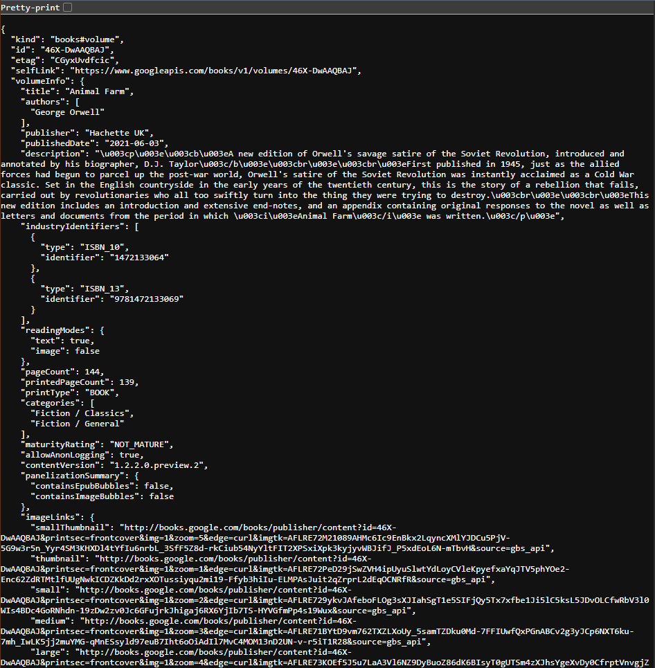

- - -

**Soal 3**

Tambahkan kode pada onPressed di ElevatedButton seperti berikut.

Jelaskan maksud kode langkah 5 tersebut terkait substring dan catchError!

**Jawaban:** substring(0, 450) dimaksudkan agar kode hanya mengambil 450 karakter pertama sebagai output, sedangkan catchError(...) dimaksudkan untuk menangkap error jika ada suatu hal di kode tidak befungsi dengan benar yang menyebabkan aplikasi crash, maka aplikasi akan mengatur result ke pesan error yang ada.

Capture hasil praktikum Anda berupa GIF dan lampirkan di README. Lalu lakukan commit dengan pesan "W11: Soal 3".

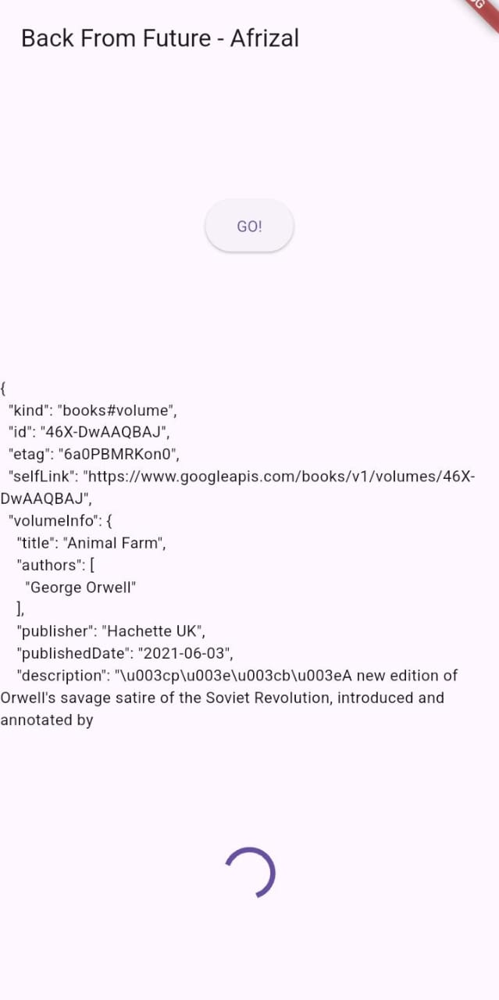

## Praktikum 2

**Soal 4**

Jelaskan maksud kode langkah 1 dan 2 tersebut!

**Jawaban**: Pada langkah 1, tiga fungsi returnOneAsync, returnTwoAsync, dan returnThreeAsync dengan masing-masing fungsi akan menunggu selama 3 detik dengan `Future.delayed(const Duration(seconds: 3))` lalu melakukan return sebuah angka. Dan pada langkah kedua, fungsi count digunakan untuk memanggil ketiga fungsi tadi, dengan memulai count dari 0, menunggu 3 detik untuk untuk menambah total menjadi 1 dengan memanggil `await returnOneAsync()`, tunggu 3 detik lagi untuk `await returnTwoAsync()` dan menambahkan 2 pada total (total = (1 + 2)) lalu tunggu 3 detik lagi pada `await returnThreeAsync()` untuk menambahkan 3 pada total, yang membuat hasil menjadi 6. Setelah semua selesai, update UI dengan `setState`

Capture hasil praktikum Anda berupa GIF dan lampirkan di README. Lalu lakukan commit dengan pesan "W11: Soal 4".

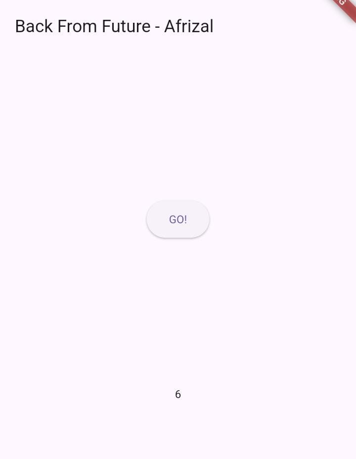

## Praktikum  3

**Soal 5**

Jelaskan maksud kode langkah 2 tersebut!

**Jawaban**: Completer digunakan untuk menyimpan future dan complete. lalu gunakan getNumber() berisi membuat objek completer yang membuat future yang kosong, lalu gunakan calculate() untuk melakukan tugas secara asynchronous di background lalu lanjut ke baris berikutnya yang berisi return completer.future yang dimana fungsi getNumber() akan langsung mengembalikan Future yang kosong ke pemanggil aslinya dan melakukan await sambil menunggu Future selesai. Saat `calculate()`, lakukan calculate dengan jeda selama 5 detik karena Future.delayed() dan setelah 5 detik berlalu, `calculate` akan men-trigger Comepleter yang sama dan mengisi nilainya dengan nilai 42. Setelah 5 detik, await selesai, dan pemanggilnya mendapatkan nilai 42.

Capture hasil praktikum Anda berupa GIF dan lampirkan di README. Lalu lakukan commit dengan pesan "W11: Soal 5".

- - -

**Soal 6**

Jelaskan maksud perbedaan kode langkah 2 dengan langkah 5-6 tersebut!

**Jawaban**: Pada langkah tersebut, perbedaan yang ada adalah dengan menambahkan try-catch untuk melakukan catch error yang dapat menyebabkan crash dan hanya mengeluarkan nilai result pada langkah ke 6 sebagai langkah preventif agar aplikasi tidak crash.

Capture hasil praktikum Anda berupa GIF dan lampirkan di README. Lalu lakukan commit dengan pesan "W11: Soal 6".

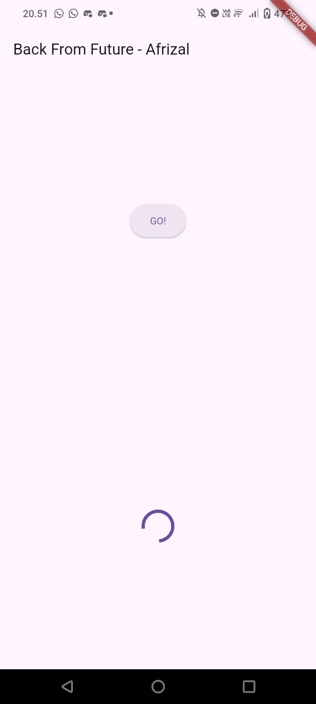

## Praktikum 4

**Soal 7**

Capture hasil praktikum Anda berupa GIF dan lampirkan di README.

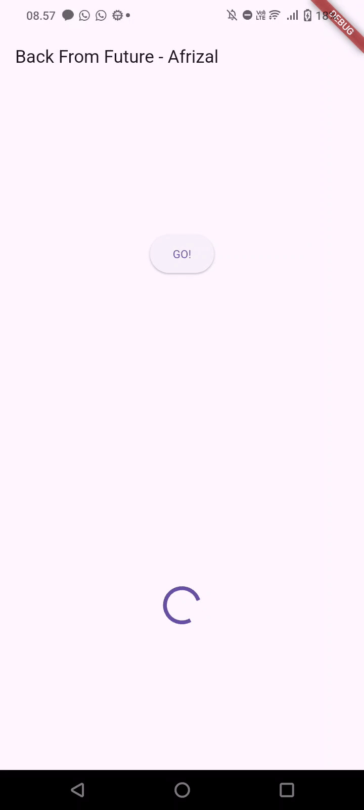

- - -

**Soal 8**

Jelaskan maksud perbedaan kode langkah 1 dan 4!

**Jawaban:** Perbedaan dari kode langkah 1 dan 4 adalah langkah 1 menggunakan langkah manual yang berasal dari package FutureGroup dan menambahkan dengan `.add()` satu per satu secara manual, lalu `.close()` yang harus ada untuk menutup kode groupnya. Sedangkan pada langkah 4, kode tersebut digunakan dari fungsi bawaan `dart:async` yang bekerja secara static. Ini diisi dengan semua Future yang ingin dijalankan dan dikerjakan secara paralel dan mengembalikan Future baru yang selesai jika semua Future dalam list selesai.

## Praktikum 5

**Soal 9**

Capture hasil praktikum Anda berupa GIF dan lampirkan di README.

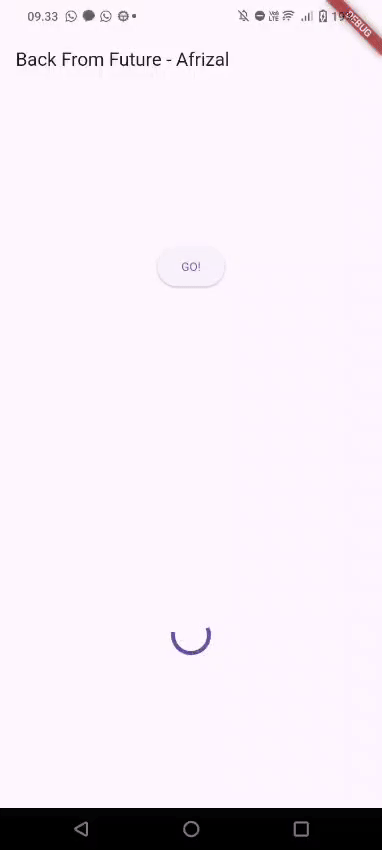

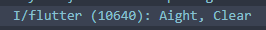

- - - 

**Soal 10**

Panggil method handleError() tersebut di ElevatedButton, lalu run. Apa hasilnya? Jelaskan perbedaan kode langkah 1 dan 4!

**Jawaban:** Dari segi visual, tidak ada perubahan yang signifikan dari segi output. Namun, secara fungsional berbeda, pada langkah 1 hanya membuat method untuk mengeluarkan pesan errornya yang harus di panggil secara manual dengan fungsi yang digunakan pada `ElevatedButton` pada langkah selanjutnya. Sedangkan pada langkah 4, memanfaatkan fungsi yang sudah dibuat pada langkah pertama, pesan error akan dikeluarkan jika try gagal dan akan dicatch oleh blok `catch` untuk menampilkan pesan exception menjadi string dan mencegah crash dan finally digunakan jika semua kode bekerja secara normal dan digunakan oleh logging

## Praktikum 6

Tambahkan nama panggilan Anda pada tiap properti title sebagai identitas pekerjaan Anda.

```
@override
  Widget build(BuildContext context) {
    return Scaffold(
      appBar: AppBar(title: const Text('Current Location - Afrizal')),
      body: Center(child: Text(myPosition)),
    );
  }
```

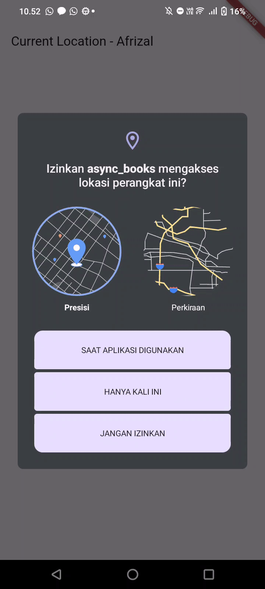

- - -

**Soal 12**

- Jika Anda tidak melihat animasi loading tampil, kemungkinan itu berjalan sangat cepat. Tambahkan delay pada method getPosition() dengan kode await Future.delayed(const Duration(seconds: 3));
- Apakah Anda mendapatkan koordinat GPS ketika run di browser? Mengapa demikian?
- Capture hasil praktikum Anda berupa GIF dan lampirkan di README. Lalu lakukan commit dengan pesan "W11: Soal 12".

**Jawaban:**

```dart
Future<Position> getPosition() async {
    await Geolocator.requestPermission();
    await Geolocator.isLocationServiceEnabled();
    Position position = await Geolocator.getCurrentPosition();
    // DELAY for LOADING ANIMATION HANDLING
    await Future.delayed(const Duration(seconds: 3));
    return position;
  }
```

- Koordinat GPS dapat digunakan pada web karena package geolocator mendukung untuk penggunaan pada web, selama izin untuk menggunakan lokasi telah di setujui.

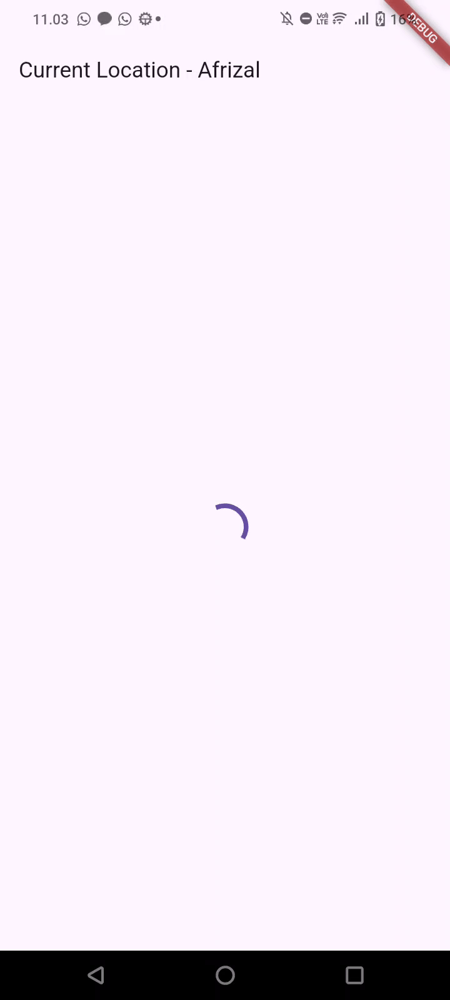

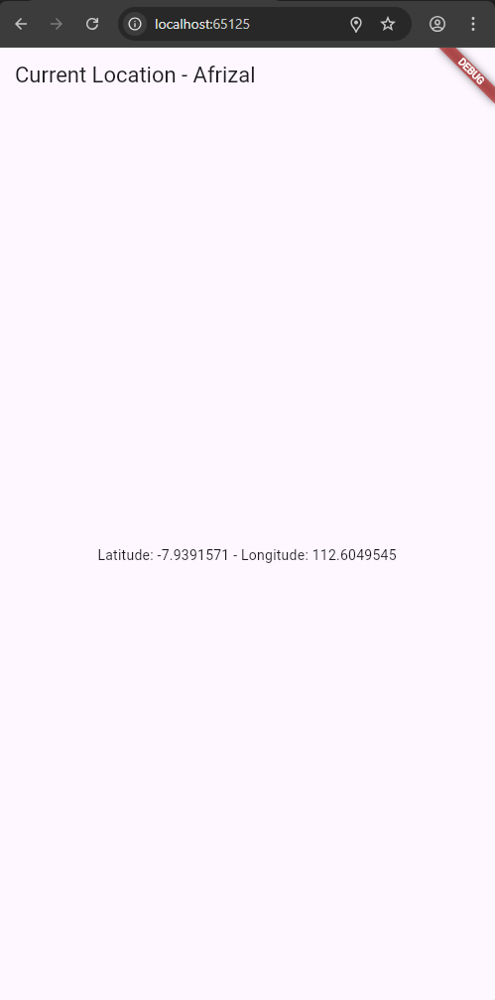

## Praktikum 7

**Soal 13**

- Apakah ada perbedaan UI dengan praktikum sebelumnya? Mengapa demikian?
- Capture hasil praktikum Anda berupa GIF dan lampirkan di README. Lalu lakukan commit dengan pesan "W11: Soal 13".
- Seperti yang Anda lihat, menggunakan FutureBuilder lebih efisien, clean, dan reactive dengan Future bersama UI.

**Jawaban:**
- Tidak ada perubahan dari segi UI secara tampilan. Namun, pada back-end, metode pada percobaan sebelumnya masih menggunakan metode manual sedangkan pada kode yang diubah sudah menggunakan `FutureBuilder` yang secara otomatis memanggil `setState` dari dari internal.

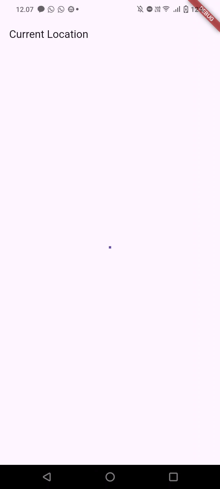

> Hasil merupakan NULL karena aplikasi tidak memiliki izin untuk mengakses lokasi pengguna.

**Soal 14**
- Apakah ada perbedaan UI dengan langkah sebelumnya? Mengapa demikian?
- Capture hasil praktikum Anda berupa GIF dan lampirkan di README.

**Jawaban:**
- Tidak ada perubahan pada UI, ini dikarenakan hanya menambahkan untuk handling error jika lokasi mengalami error. Dari segi tampilan, UI terlihat sama persis.


> Hasil masih merupakan NULL karena aplikasi tidak memiliki izin untuk mengakses lokasi pengguna.

## Praktikum 8

**Soal 15**

Tambahkan nama panggilan Anda pada tiap properti title sebagai identitas pekerjaan Anda & Silakan ganti dengan warna tema favorit Anda.

`navigation_first.dart`:
```dart
class _NavigationFirstState extends State<NavigationFirst> {
  Color color = Colors.purple.shade300;

  Future _navigateAndGetColor(BuildContext context) async {
    color = await Navigator.push(context, MaterialPageRoute(builder: (context) => const NavigationSecond()),) ?? Colors.blue;
   setState(() {});
  }

  @override
  Widget build(BuildContext context) {
    return Scaffold(
      backgroundColor: color,
      appBar: AppBar(
        title: const Text('Navigation First Screen - Afrizal'),
      ),
      body: Center(
        child: ElevatedButton(
          child: const Text('Change Color'),
          onPressed: () {
            _navigateAndGetColor(context);
          },
        ),
      ),
    );
  }
}
```

**Soal 16**

- Cobalah klik setiap button, apa yang terjadi ? Mengapa demikian ?
- Gantilah 3 warna pada langkah 5 dengan warna favorit Anda!
- Capture hasil praktikum Anda berupa GIF dan lampirkan di README. Lalu lakukan commit dengan pesan "W11: Soal 16".

**Jawaban**

- Setiap tombol akan mengantarkan ke tampilan pada navigation second untuk melakukan pergantian warna melalui builder. Lalu, tiga tombol ditampilkan dan jika ditekan akan mengembalikan/passing nilai warna dengan `Navigator.pop` ke halaman Navigation First untuk menetapkan warna Background di halaman Navigation First.

- `navigation_second.dart`:
```dart
appBar: AppBar(
        title: const Text('Navigation Second Screen - Afrizal'),
      ),
      body: Center(
        child: Column(
          mainAxisAlignment: MainAxisAlignment.spaceEvenly,
          children: [
            ElevatedButton(
              child: const Text('Green'),
              onPressed: () {
                color = Colors.green.shade400;
                Navigator.pop(context, color);
              },
            ),
            ElevatedButton(
              child: const Text('Purple'),
              onPressed: () {
                color = Colors.purple.shade300;
                Navigator.pop(context, color);
              },
            ),
            ElevatedButton(
              child: const Text('Blue'),
              onPressed: () {
                color = Colors.lightBlue.shade500;
                Navigator.pop(context, color);
              },
            ),
          ],
        ),
      ),
```

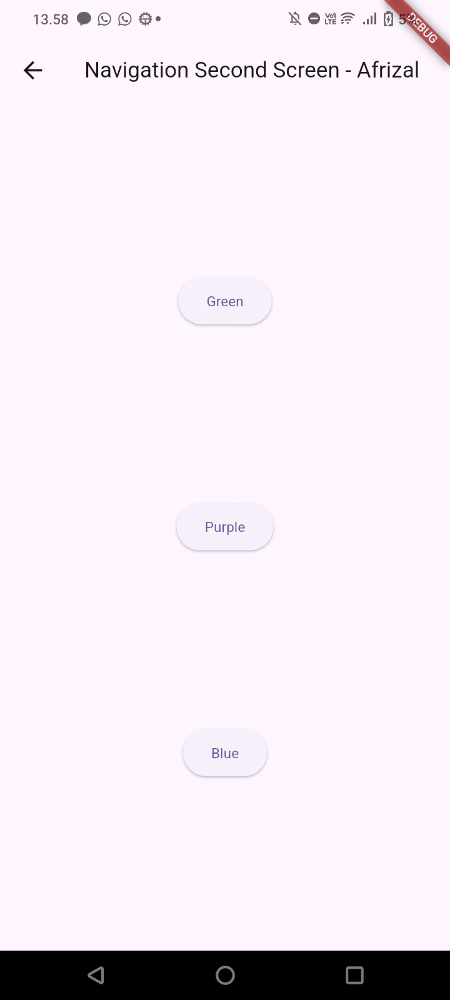

## Percobaan 9

- Cobalah klik setiap button, apa yang terjadi ? Mengapa demikian ?
- Gantilah 3 warna pada langkah 3 dengan warna favorit Anda!
- Capture hasil praktikum Anda berupa GIF dan lampirkan di README.

- Yang terjadi adalah warna background akan terganti menjadi apa yang dipilih, misalkan "Red" akan mengubah warna Background menjadi warna yang bersangkutan. Ini dikarenakan variabel color nilainya diubah setelah memilih warna yang bersangkutan, menggunakan `Navigator.pop` akan menutup AlertDialog dan menyelesaikan `await` pada `_showColorDialog` yang akan melanjutkan ke baris berikutnya. Lalu `setState` berjalan dan mengubah state dan melakukan render ulang dengan rebuild dengan nilai variabel color yang baru yang digunakan pada `backgroundColor:` pada metode build.

- Perubahan pada warna, selain mengganti, ada penambahan pada pilihan warna.
`navigation_dialogue`:
```dart
_showColorDialog(BuildContext context) async {
    await showDialog(
      barrierDismissible: false,
      context: context,
      builder: (_) {
        return AlertDialog(
          title: const Text('"CHOOSE"'),
          content: const Text(
            'Here was no plaint that could be heard of grief, \n'
            'Except of sighs, which made the eternal air '
            'Tremble and tremble strong, as if it would have burst \n'
            'And fallen in showers.',
            ),
          actions: <Widget>[
            TextButton(
              child: const Text('Red Key'),
              onPressed: () {
                color = Colors.red.shade600;
                Navigator.pop(context, color);
              },
            ),
            TextButton(
              child: const Text('Green Key'),
              onPressed: () {
                color = Colors.green.shade300;
                Navigator.pop(context, color);
              },
            ),
            TextButton(
              child: const Text('Cyan Key'),
              onPressed: () {
                color = Colors.lightBlue.shade300;
                Navigator.pop(context, color);
              },
            ),
            TextButton(
              child: const Text('Blue Key'),
              onPressed: () {
                color = Colors.blue.shade700;
                Navigator.pop(context, color);
              },
            ),
            TextButton(
              child: const Text('Purple Key'),
              onPressed: () {
                color = Colors.purple.shade400;
                Navigator.pop(context, color);
              },
            ),
            TextButton(
              child: const Text('Teal Key'),
              onPressed: () {
                color = Colors.teal.shade300;
                Navigator.pop(context, color);
              },
            ),
            TextButton(
              child: const Text('Yellow Key'),
              onPressed: () {
                color = Colors.yellow.shade400;
                Navigator.pop(context, color);
              },
            ),
            TextButton(
              child: const Text('Pink Key'),
              onPressed: () {
                color = Colors.pink.shade400;
                Navigator.pop(context, color);
              },
            ),
          ],
        );
      },
    );
    setState(() {});
  }
```

