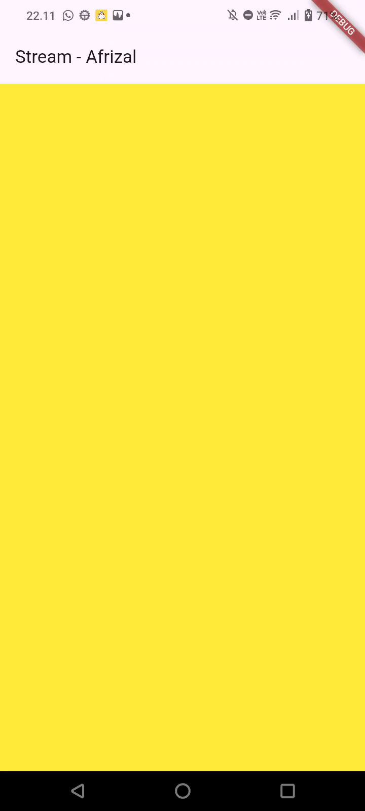
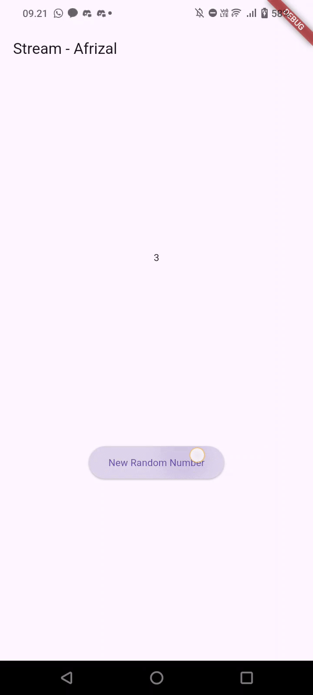
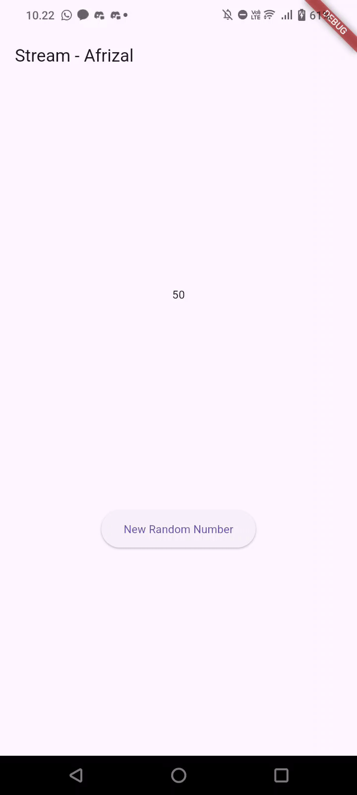
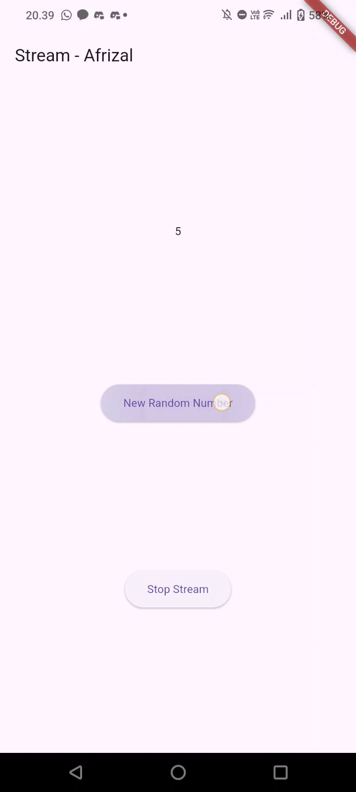
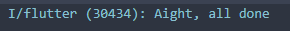
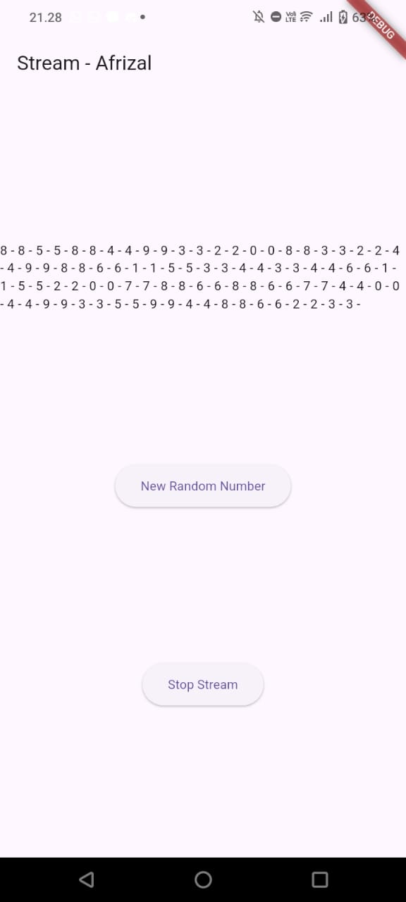
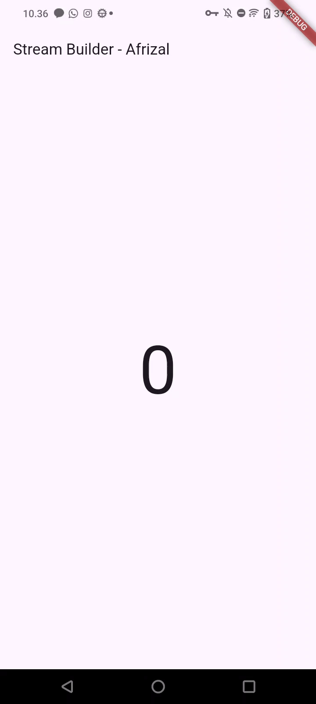
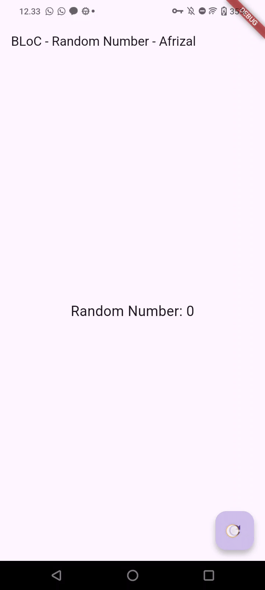

# Pemrograman Mobile - Codelab #11
Codelab #11 - Asynchronous Programming

NIM: 2341720083

Nama: Afrizal Qurratul Faizin

**Laporan berupa jawaban dari masing-masing soal.**

- - -

## Praktikum 1

**Soal 1**

- Tambahkan nama panggilan Anda pada title app sebagai identitas hasil pekerjaan Anda.
- Gantilah warna tema aplikasi sesuai kesukaan Anda.

Jawaban:

Perubahan nama panggilan beserta warna tema aplikasi menjadi indigo pada widget build MyApp:
```
return MaterialApp(
      title: 'Stream - Afrizal',
      theme: ThemeData(
        primarySwatch: Colors.indigo,
      ),
      home: const StreamHomePage(),
    );
```

- - -

**Soal 2**

- Tambahkan 5 warna lainnya sesuai keinginan Anda pada variabel colors tersebut.

**Jawaban**:

Perubahan yang ada pada file stream.dart adalah sebagai berikut:
```
final List<Color> colors = [
    Colors.blueGrey,
    Colors.amber,
    Colors.deepPurple,
    Colors.lightBlue,
    Colors.teal,
    // THE EIGHT LIMBO KEYS <<== Additional
    Colors.lightGreen,
    Colors.red,
    Colors.pink,
    Colors.yellow,
    Colors.blue
  ];
```

- - -

**Soal 3**

- Jelaskan fungsi keyword yield* pada kode tersebut!
- Apa maksud isi perintah kode tersebut?

**Jawaban:**

- `yield*` digunakan untuk mendelegasikan seluruh stream lain kedalam stream saat ini. Jadi Stream akan menyiarkan semua event yang berasal dari Stream.periodic.
- Keseluruhkan kode tersebut membuat Stream yang akan terus berulang dan akan mengeluarkan warna berbeda pada satu detik dengan `int t` berupa t adalah tick (detik), dilanjut dengan trik modulo untuk melakukan "Looping", menggunakan hasil modulo untuk memutar warna, lalu lakukan return.

- - -

**Soal 4**

- Capture hasil praktikum Anda berupa GIF dan lampirkan di README.

**Hasil Capture**:



- - -

**Soal 5**

- Jelaskan perbedaan menggunakan listen dan await for (langkah 9)!

**Jawaban:**

- Listen akan bekerja seperti langganan dan memberi callback, dan setelah kode listen(), baris dibawahnya akan langsung di eksekusi dan untuk mencegah memory leak.
- Sedangkan await for, akan berhenti sebelum data dimasukkan, setelah itu lakukan kode di bawahnya akan dijalankan, dan loop kode akan selesai jika stream-nya `onDone`.

- - -

## Praktikum 2

**Soal 6**

- Jelaskan maksud kode langkah 8 dan 10 tersebut!
- Capture hasil praktikum Anda berupa GIF dan lampirkan di README.

**Jawaban**

- kode pada initState digunakan untuk memasang listener ke stream angka dengan membuat objek baru dari NumberStream, ambil properti controller dari objek numberStream yang baru saja dibuat dan ambil saluran keluar dari StreamController lalu langganan ke Stream dengan `stream.listen((event) { ... });` dan setState yang digunakan untuk call back yang otomatis berjalan setiap ada event baru yang masuk ke stream.
- Sedangkan pada langkah 10, objek random dibuat untuk membuat angka acak, dan gunakan random untuk membuat angka pseudo-acak integer yang kurang dari 10 (0 sampai 9) lalu masukkan angka tersebut kedalam sink dari numberStream dan membuat listener menerima angka dan memperbarui UI.



- - -

**Soal 7**

- Jelaskan maksud kode langkah 13 sampai 15 tersebut!
- Kembalikan kode seperti semula pada Langkah 15, comment addError() agar Anda dapat melanjutkan ke praktikum 3 berikutnya.

**Jawaban**

- Kode ditambahkan addError() untuk secara manual melempar data error kedalam sink dan akan ditangkan oleh listener dan onError() akan berjalan dan memaksa UI menampilkan `lastNumber = -1`. Pada fungsi addRandomNumber() sekarang digunakan untuk memanggil addError untuk mengubah RNG menjadi "Crash Application Button" untuk membuat error dan membuat aplikasi crash.

- - -

## Praktikum 3

**Soal 8**

- Jelaskan maksud kode langkah 1-3 tersebut!
- Capture hasil praktikum Anda berupa GIF dan lampirkan di README.

**Jawaban**

- Pertama, late variable dibuat untuk menampung aturan bagaimana data stream akan diubah, lalu buat transformer dengan aturan spesifik  untuk menghandle data yang masuk (handleData), error yang masuk (handleError), dan close stream jika stream selesai (handleDone), lalu gunakan transformer yang membuat stream dari dengan data yang sudah diubah ((angka 0 - 9) * 10) dan listen ke stream yang baru. setState akan menerima angka kelipatan 10 dari 0 sampai 90 atau -1 jika terjadi error.



- - -

## Praktikum 4

**Soal 9**

- Jelaskan maksud kode langkah 2, 6 dan 8 tersebut!
- Capture hasil praktikum Anda berupa GIF dan lampirkan di README.

**Jawaban**

- InitState digunakan untuk menyiapkan controller dan stream beserta subscriptionnya dengan listen untuk memanggil lastNumber di UI dan akan digunakan lagi nanti. Pada langkah 6, dispose akan menghancurkan widget dan meng-cancel untuk mencegah memory leak dan pada addRandomNumber, jika stream masih terbuka, masukkan angka-nya ke UI, lalu jika stream berhenti, maka tampilkan -1 di layar





- - -

## Praktikum 5

**Soal 10**

- Jelaskan mengapa error itu bisa terjadi ?

**Jawaban**

- Error ini terjadi jika ada dua subscription yang mencoba untuk me-listen dalam waktu yang bersamaan. Secara default, Dart hanya memperbolehkan satu stream dapat di listen satu kali oleh satu listener.

- - -

**Soal 11**
- Jelaskan mengapa hal itu bisa terjadi ?
- Capture hasil praktikum Anda berupa GIF dan lampirkan di README.

**Jawaban**

- Ini dapat terjadi dikarenakan perbaikan kode stream menjadi .asBroadcastStream() yang akan melakukan broadcast sehingga dapat di-listen oleh lebih dari satu listener, karena ada 2 listener, maka update value akan sebanyak 2 kali.



- - -

## Praktikum 6

**Soal 12**

- Jelaskan maksud kode pada langkah 3 dan 7 !
- Capture hasil praktikum Anda berupa GIF dan lampirkan di README.

**Jawaban**

- Pada langkah ke-3, kode akan melakukan yield semua stream secara periodik dengan durasi 1 detik sebagai 1 tick. Pada 1 detik tersebut, objek random dibuat, buat angka acak dari 0 sampai 9 lalu lakukan return hasil tersebut. Pada langkah 7, buat numberStream dan buat data inisial sebesar 0, di builder, snapshot berisi status stream, dan proses pembuatan UI berada di builder. Pertama, cek snapshot apakah melempar error atau tidak, jika ada error, masukkan "Error" ke console, dan jika mempunyai data (hasData), buat teks di tengah berisi data angka yang dibuat pada langkah 3. Dan jika stream tidak error dan tidak ada data, maka kotak kosong akan ditampilkan pada UI



- - -

## Praktikum 7

**Soal 13**

- Jelaskan maksud praktikum ini ! Dimanakah letak konsep pola BLoC-nya ?
- Capture hasil praktikum Anda berupa GIF dan lampirkan di README.

**Jawaban**

- Konsep BLoC ini membagi aplikasi menjadi 2 bagian: UI dan BLoC (Logic/Backend). Pada bagian BLoC, BLoC merupakan back-end yang hanya menerima perintah dan me-return hasil dari BLoC. Pada kode ini, konsep pola BLoC berada pada pemisahan file screen dan file BLoC, sementara main hanya melakukan launch pada screen yang ada pada file screen.

