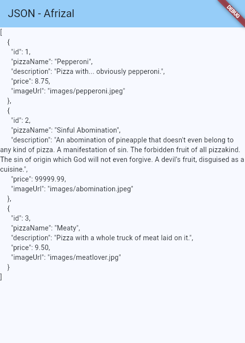
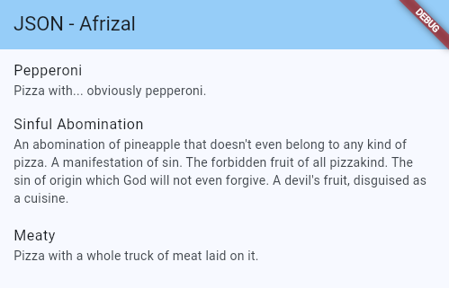
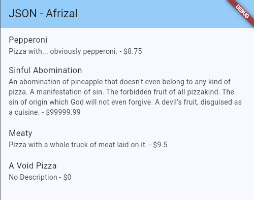
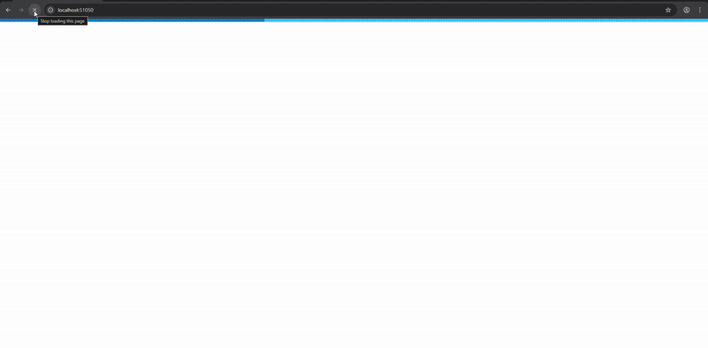
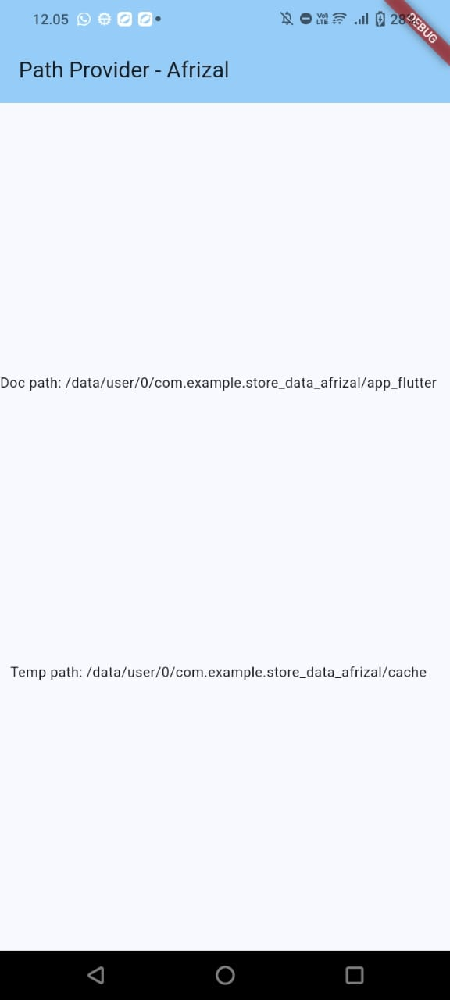
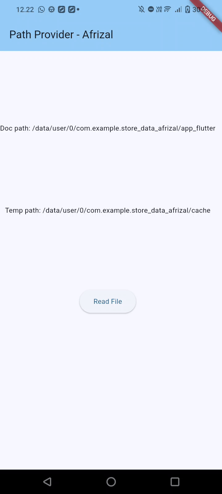
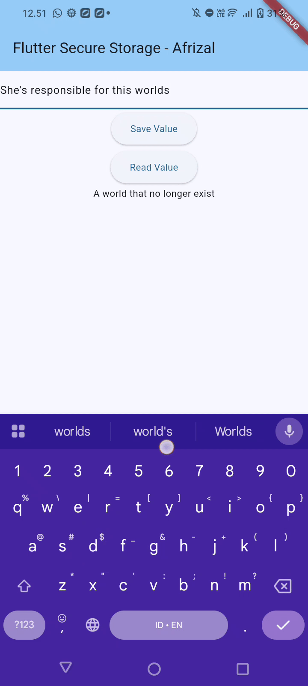

# Pemrograman Mobile - Codelab #12
Codelab #12 - Lanjutan State Management dengan Streams

NIM: 2341720083

Nama: Afrizal Qurratul Faizin

**Laporan berupa jawaban dari masing-masing soal.**

- - -

## Praktikum 1

**Soal 1**

- Tambahkan nama panggilan Anda pada title app sebagai identitas hasil pekerjaan Anda.
- Gantilah warna tema aplikasi sesuai kesukaan Anda.

**Jawaban:**

Nama Panggilan pada title app dan perubahan warna tema aplikasi pada main.dart:
```dart
  @override
  Widget build(BuildContext context) {
    return MaterialApp(
      title: 'Flutter JSON Demo - Afrizal',
      theme: ThemeData(
        colorScheme: ColorScheme.fromSeed(seedColor: Colors.lightBlue),
      ),
      home: const MyHomePage(),
    );
  }
```

- - -

**Soal 2**

- Masukkan hasil capture layar ke laporan praktikum Anda.

**Jawaban:**



- - -

**Soal 3**

- Masukkan hasil capture layar ke laporan praktikum Anda.

**Jawaban:**



- - -
## Praktikum 2
**Soal 4**

- Capture hasil running aplikasi Anda, kemudian impor ke laporan praktikum Anda!

**Jawaban:**


- - -
## Praktikum 3
**Soal 5**

- Jelaskan maksud kode lebih safe dan maintainable!
- Capture hasil praktikum Anda dan lampirkan di README.

**Jawaban:**

- Kode pada percobaan ini lebih aman dan mudah dirawat karena penggunaan const key dan penanganan error saat melakukan parsing dengan menggunakan Ternary. Ini digunakan untuk mencegah Typo karena data yang salah ketik, ini juga dapat digunakan untuk perawatan jika API berubah.



- - -
## Praktikum 4
**Soal 6**

- Capture hasil praktikum Anda berupa GIF dan lampirkan di README.

**Jawaban:**



- - -
## Praktikum 5
**Soal 7**

- Capture hasil praktikum Anda dan lampirkan di README.

**Jawaban:**



- - -
## Praktikum 6
**Soal 8**

- Jelaskan maksud kode pada langkah 3 dan 7!
- Capture hasil praktikum Anda berupa GIF dan lampirkan di README.

**Jawaban:**

- Pada langkah 3, function dibuat untuk menulis file untuk menuliskan kata kata tertentu pada sebuah file menggunakan Future secara asynchronous. Pada langkah 7, dengan menekan tombol pada tampilan, maka file yang sebelumnya dibuat akan dibaca dan ditampilkan dibawah layar



- - -
## Praktikum 7
**Soal 9**

- Capture hasil praktikum Anda berupa GIF dan lampirkan di README.

