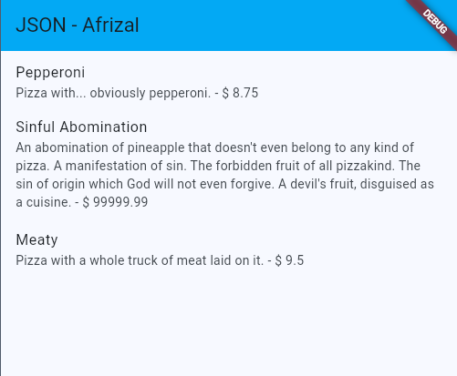
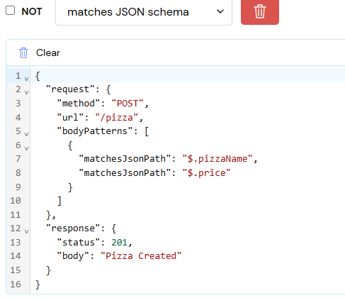
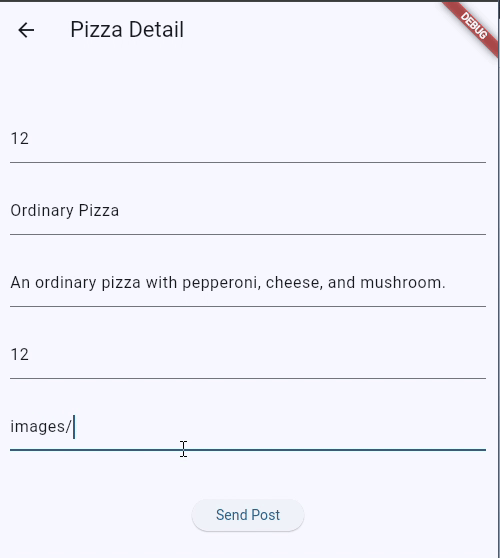
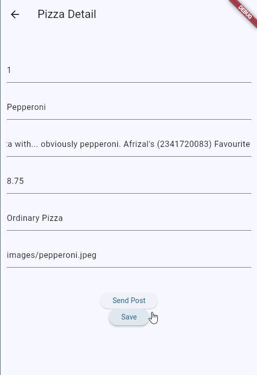
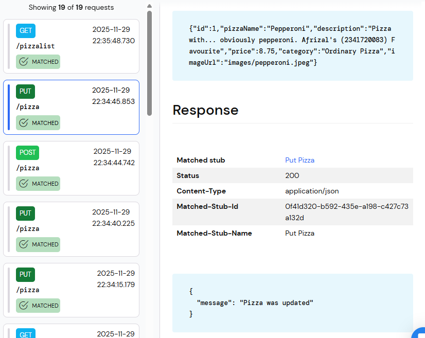
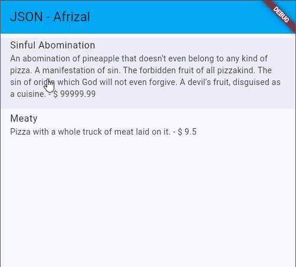

# Pemrograman Mobile - Codelab #14
Codelab #14 - RESTful API

NIM: 2341720083

Nama: Afrizal Qurratul Faizin

**Laporan berupa jawaban dari masing-masing soal.**

- - -

## Praktikum 1

- Tambahkan nama panggilan Anda pada title app sebagai identitas hasil pekerjaan Anda.
- Gantilah warna tema aplikasi sesuai kesukaan Anda.
- Capture hasil aplikasi Anda, lalu masukkan ke laporan di README dan lakukan commit hasil jawaban Soal 1 dengan pesan "W14: Jawaban Soal 1"

**Jawaban**

```
appBar: AppBar(title: const Text('JSON - Afrizal'), backgroundColor: Colors.lightBlue),
```



- - -

## Praktikum 2

- Tambahkan field baru dalam JSON maupun POST ke Wiremock!
- Capture hasil aplikasi Anda berupa GIF di README dan lakukan commit hasil jawaban Soal 2 dengan pesan "W14: Jawaban Soal 2"

**Jawaban**

Field Baru pada JSON:
```json
{ 
  "id": 1, 
  "pizzaName": "Pepperoni", 
  "description": "Pizza with... obviously pepperoni.",
  "price": 8.75, 
  "category": "Meaty",
  "imageUrl": "images/pepperoni.jpeg" 
} 
```

Field baru pada POST Wiremock:



Hasil Record:



Hasil Record setelah Pembaruan Field:


- - -

## Praktikum 3

- Ubah salah satu data dengan Nama dan NIM Anda, lalu perhatikan hasilnya di Wiremock.
- Capture hasil aplikasi Anda berupa GIF di README dan lakukan commit hasil jawaban Soal 3 dengan pesan "W14: Jawaban Soal 3"

**Jawaban:**





- - -

## Praktikum 4

- Capture hasil aplikasi Anda berupa GIF di README dan lakukan commit hasil jawaban Soal 4 dengan pesan "W14: Jawaban Soal 4"

